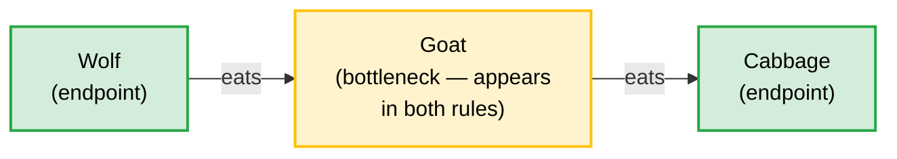
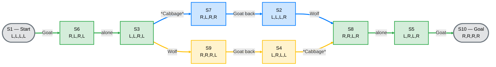

# Constraint-Graph Testbed — $P_3$ River Crossing

**Status:** Active exploration — not theory, not principles. Claims here are candidates for later promotion or retraction.

**Purpose:** Uses the Wolf-Goat-Cabbage puzzle to test $\mathsf{P1}$'s node identity clause against a concrete constraint graph. The state-space of this puzzle is a bidirectional transition graph (not a DAG); the constraint structure over predation relations is a directed $P_3$ path (a DAG). This document analyses both, but the SIRC-relevant object is the constraint graph. If the puzzle can be fully described as a SIRC constraint packet, that tells us something about what general constraint-graph construction requires.

**Companion document:** `P_4_river_crossing.md` *(forthcoming)* — extends this analysis to a $P_4$ constraint graph (Fox–Chicken–Caterpillar–Leaf). Results here are the baseline all $\mathsf{P4}$ claims are compared against.

**Methods applied:**

| Method | What it does here | Part | Status |
| :--- | :--- | :--- | :--- |
| State space enumeration | Derives $\mathcal{J}^+$ and $\mathcal{J}^-$ by exhaustive application of constraint rules to all $2^4$ states | I | Complete |
| Transition graph construction | Maps valid states as nodes and legal *Farmer* moves as edges; identifies solution paths | I | Complete |
| Constraint ablation | Removes each predation rule in isolation — establishes necessity of each rule | II | Complete |
| Inferential role substitution | Replaces one object's relational definition while preserving its label — tests label vs. role identity | II | Complete |
| Cross-substrate structural comparison | Treats four independent cultural traditions as separate receiver substrates | III | Complete |

**Epistemic structure:** This document uses three explicit layers. Claims do not cross layers without promotion.

| Part | Layer | Epistemic status |
| :--- | :--- | :--- |
| I — Formal record | §1–5 | Proven by enumeration. No interpretation required. |
| II — Structural observations | §6–8 | Patterns visible in the enumerated data. Observable here; not yet proved to hold for other constraint graphs. |
| III — SIRC connections | §9–12 | Candidate claims connecting structural observations to SIRC principles. Falsifiable by $P_4$ and Hanoi. |
| IV — Scope and open questions | §13–15 | What this puzzle cannot establish, and the questions it raises. |

---

## Table of Contents

| Section | Title | Part | Epistemic status |
| :--- | :--- | :--- | :--- |
| §1 | Why this puzzle | I — Formal record | Proven by enumeration |
| §2 | Formal encoding | I — Formal record | Proven by enumeration |
| §3 | $\mathcal{J}^-$ — the invalid states | I — Formal record | Proven by enumeration |
| §4 | $\mathcal{J}^+$ — the ten valid states | I — Formal record | Proven by enumeration |
| §5 | The transition graph | I — Formal record | Proven by enumeration |
| §6 | Constraint graph properties | II — Structural observations | Observable in data; not yet proved to generalise |
| §6.1 | Bottleneck structure and forced moves | II — Structural observations | Observable in data; not yet proved to generalise |
| §6.2 | Solution path structure — trunk and branches | II — Structural observations | Observable in data; not yet proved to generalise |
| §7 | Minimum sufficient boundary (ablation) | II — Structural observations | Observable in data; not yet proved to generalise |
| §8 | Node identity by inferential role | II — Structural observations | Observable in data; not yet proved to generalise |
| §8.1 | Label-free identification | II — Structural observations | Observable in data; not yet proved to generalise |
| §8.2 | Nomenclature mismatch test | II — Structural observations | Observable in data; not yet proved to generalise |
| §9 | $\mathsf{P1}$ — entailment equivalence across solution paths | III — SIRC connections | Candidate claim; falsifiable by $P_4$ and $P_n$ |
| §10 | $\mathsf{P3}$ — boundary transmission | III — SIRC connections | Candidate claim; falsifiable by $P_4$ and $P_n$ |
| §11 | $\mathsf{P4}$ — work allocation | III — SIRC connections | Candidate claim; falsifiable by $P_4$ and $P_n$ |
| §12 | Cultural universality and the fitness peak hypothesis | III — SIRC connections | Candidate claim; falsifiable by $P_4$ and $P_n$ |
| §12.1 | The observed pattern | III — SIRC connections | Candidate claim; falsifiable by $P_4$ and $P_n$ |
| §12.2 | The structural basis — $P_3$ is the only graph at the boundary | III — SIRC connections | Candidate claim; falsifiable by $P_4$ and $P_n$ |
| §12.3 | Node identity across cultural substrates — $\mathsf{P3}$ evidence for a $\mathsf{P1}$ question | III — SIRC connections | Candidate claim; falsifiable by $P_4$ and $P_n$ |
| §12.4 | What this section establishes and does not establish | III — SIRC connections | Candidate claim; falsifiable by $P_4$ and $P_n$ |
| §12.5 | The unsolved directionality question | III — SIRC connections | Candidate claim; falsifiable by $P_4$ and $P_n$ |
| §13 | What this puzzle does not resolve | IV — Scope and open questions | Scope limitation |
| §14 | Open questions for general constraint-graph construction | IV — Scope and open questions | Open question |
| §15 | Extensions — larger constraint graphs | IV — Scope and open questions | Open question |
| §15.1 | The $P_4$ extension — four transported objects | IV — Scope and open questions | Open question |
| §15.2 | Tower of Hanoi — $P_n$ ordering constraint | IV — Scope and open questions | Open question |
| §15.3 | What the extensions do not resolve | IV — Scope and open questions | Scope limitation |

---

## Notation

*Defined upfront for single-pass readers. All symbols appear in §2 or later. Human readers may proceed directly to §1 and return here on first symbol encounter.*

| Symbol | Meaning | Defined |
| :--- | :--- | :--- |
| $\mathcal{S}$ | Full state space — all $2^4 = 16$ configurations $(F, W, G, C)$ | §2 |
| $\mathcal{R}$ | Predation rules — the constraint packet transmitted to the receiver. Distinct from $\mathcal{J}^-$: the rules are what is transmitted; $\mathcal{J}^-$ is what they generate. Relationship: $\mathcal{J}^- = \{ s \in \mathcal{S} \mid \mathcal{R}(s) = \text{invalid} \}$ | §2 |
| $\mathcal{J}^-$ | Invalid states — configurations excluded by applying $\mathcal{R}$ to $\mathcal{S}$ | §3 |
| $\mathcal{J}^+$ | Valid states — $\mathcal{S} \setminus \mathcal{J}^-$; the state space the receiver reconstructs | §4 |
| $S_n$ | Individual state node — $S_1$ is the start state $(L,L,L,L)$; $S_{10}$ is the goal state $(R,R,R,R)$; $S_2\text{–}S_9$ are intermediate valid states. Full enumeration in §4. | §4 |
| $e_n$ | Individual transition edge — labelled by what the Farmer carries ($e_1\text{–}e_{10}$). Full enumeration in §5. | §5 |
| $\mathcal{G}_T$ | Transition graph — the undirected graph on $\mathcal{J}^+$ where nodes are valid states and edges are legal Farmer moves. Bidirectional: every edge can be traversed in either direction (the puzzle is physically reversible). Distinct from the constraint graph ($P_3$) — see scope note below table. | §5 |
| $P_n$ | Path graph on $n$ nodes — $P_3$ has $3$ nodes and $2$ edges; $P_4$ has $4$ nodes and $3$ edges. The constraint graph is a $P_n$ when the predation rules form a linear chain with no branching. | §2 |
| $L_{\min}$ | Minimum solution length in moves | §5 |
| $N_{paths}$ | Number of distinct solution paths from $S_1$ to $S_{10}$ | §5 |
| $\tau(G)$ | Minimum vertex cover of the constraint graph — minimum set of objects the Farmer must always control | §2 precision note |
| $B_{unattended}$ | Set of objects on the bank where the Farmer is not present. Used to state the predation rules as formal set-inclusion constraints: $\{X,Y\} \not\subseteq B_{unattended}$ means $X$ and $Y$ cannot both occupy the unattended bank. Applies identically in all river crossing variants. | §2 |
| $\mathsf{P1}$, $\mathsf{P3}$, $\mathsf{P4}$ | SIRC Principles — P1 (Invariance), P3 (Constraint Packet), P4 (Work). Referenced in §9–11. Full definitions in [[SIRC_principles|SIRC_principles.md]]. | §9–11 |

*Two graphs in this document:* $\mathcal{G}_T$ (transition graph, §5) is the state-space object — bidirectional, contains cycles. The constraint graph ($P_3$, §2) is the predation-relation object — directed, acyclic. Conflating these two graphs is a typological error. However, separating them does not make the constraint graph a P1 object: its edges are predation relations ("eats"), not entailment relations ($\vdash$). The constraint graph is $\mathcal{R}$ — P3's object, the constraint packet. P1 contact in this document comes through inferential role identification (§12.3), not through the constraint graph's edges.

---

## Part I — Formal record

All claims in §1–5 are derivable by direct enumeration of the $2^4$ state space. No theoretical framework is required to verify them.

---

### §1. Why this puzzle

The river crossing puzzle has a complete, enumerable state space. Every valid state, every invalid state, every transition can be listed and checked. This makes it a testbed for three questions raised by $\mathsf{P1}$'s node identity clause:

1. **Node identity without labels** — can every node be identified by its inferential role alone (what precedes it, what follows it) with no reference to its name?
2. **Minimum sufficient boundary conditions** (OQ3.1, `SIRC_principles.md` §P3 — what constitutes the minimum sufficient boundary conditions for a reasoning structure) — what is the smallest constraint set that uniquely determines the valid state space?
3. **Nomenclature mismatch as node identity failure** — if sender and receiver define the same term with different inferential roles, does the DAG change structurally, not just lexically?

---

### §2. Formal encoding

**Four objects:** Farmer ($F$), Wolf ($W$), Goat ($G$), Cabbage ($C$). Each object is on either bank: $L$ (left, start) or $R$ (right, goal).

**State Space:** $\mathcal{S} = \{ (F, W, G, C) \mid F, W, G, C \in \{L, R\} \}$, where $|\mathcal{S}| = 2^4 = 16$.

**Move rule:** *Farmer* must move on every turn (to the opposite bank). *Farmer* may bring at most one other object. *Farmer* can only bring an object that is on his current bank.

**Move rule (formal):** Let $\bar{b}$ denote the opposite of bank $b$. A transition from state $s$ to state $s'$ is legal if and only if:

$$F_{s'} = \overline{F_s}$$

and exactly one of:

- **Farmer moves alone:** $\forall o \in \{W,G,C\},\; o_{s'} = o_s$
- **Farmer carries $x$:** $\exists x \in \{o \in \{W,G,C\} \mid o_s = F_s\}$ such that $x_{s'} = \overline{x_s}$ and $\forall o \in \{W,G,C\},\; o \neq x \Rightarrow o_{s'} = o_s$

In words: the Farmer always crosses; in the carry case, exactly one object on the Farmer's current bank crosses with him; all other objects stay. This transition function, applied to $\mathcal{J}^+$, generates the edge set of the transition graph — independently derivable from the notation without the §5 edge table.

**Internal consistency protocol:** The four formal elements below (state space, move rule, constraint packet, set relationships) are the complete specification of the puzzle. A reader or auditor can verify §3–§5 independently:
- Apply $\mathcal{R}$ to all $2^4 = 16$ states in $\mathcal{S}$ → must produce exactly the §3 invalid-state enumeration.
- $\mathcal{J}^+ = \mathcal{S} \setminus \mathcal{J}^-$ → must match the §4 valid-state list exactly.
- Apply the move rule (transition condition above) to all states in $\mathcal{J}^+$ → must produce exactly the §5 edge table.

Any mismatch is a document inconsistency. Resolve by correcting §2, then re-deriving the downstream tables — not the reverse.

**Safety Rules (Constraint Packet $\mathcal{R}$):**
Let $B_{unattended}$ be the set of objects on the bank where $F$ is not present.
- $\{W, G\} \not\subseteq B_{unattended}$
- $\{G, C\} \not\subseteq B_{unattended}$

On any bank where the *Farmer* is **not** present:
- *Wolf* and *Goat* cannot coexist. ($W$ eats $G$)
- *Goat* and *Cabbage* cannot coexist. ($G$ eats $C$)

These two rules are the **constraint packet** $\mathcal{R}$ — the minimum sufficient set of boundary conditions. The relationship between the three sets is:

$$\mathcal{J}^- = \{ s \in \mathcal{S} \mid \mathcal{R}(s) = \text{invalid} \}, \qquad \mathcal{J}^+ = \mathcal{S} \setminus \mathcal{J}^-$$

$\mathcal{R}$ is what is transmitted; $\mathcal{J}^-$ is what it generates; $\mathcal{J}^+$ is what the receiver reconstructs.

**The constraint graph:**

$P_3$ path: $3$ nodes, $2$ edges. The *Goat* is the single internal node (degree $2$) — the only object appearing in both predation rules. *Wolf* and Cabbage are endpoints (degree $1$), each appearing in one rule only.

**Precision note — vertex cover vs. minimum sufficient boundary:**

The graph-theoretic literature on river crossing puzzles (Schwartz 1961; Csorba-Hurkens-Woeginger 2008) defines the **minimum vertex cover** $\tau(G)$ as the minimum set of items that must always stay under the *Farmer*'s control to guarantee the unattended bank is safe. For the $P_3$ path ($W\text{–}G\text{–}C$), $\tau(P_3) = 1$: the *Goat* alone covers both edges. This yields the Alcuin number result: the minimum boat capacity is $\tau(G)$ or $\tau(G)+1$ — for $P_3$, $\tau(P_3) = 1$, so $1$ or $2$ items beyond the *Farmer*.

The minimum vertex cover and the $P_3$ minimum sufficient boundary measure different things from the same constraint graph:

| Measure | What it counts | $P_3$ | $P_4$ | Formula for $P_n$ |
| :--- | :--- | :---: | :---: | :---: |
| $\tau(G)$ — minimum vertex cover | Items the agent must always control | $1$ (Goat) | $2$ (Chicken, Caterpillar) | $\lfloor n/2 \rfloor$ |
| $P_3$ minimum sufficient boundary | Rules in the constraint packet | $2$ | $3$ | $n-1$ |

These grow at different rates. 
The Alcuin number result: $\tau(G) \le \mathop{\mathrm{Alcuin}}(G) \le \tau(G)+1$ is a **boat-capacity theorem** — it sets the agent's minimum capacity requirement. The $P_3$ minimum boundary result is a **rule-count theorem** — it sets the minimum constraint packet size. Conflating these produces a category error: agent capacity and rule count are independent properties of the same constraint graph.

**Terminological precision:** What the constraint-graph documents call "bottleneck nodes" corresponds precisely to the minimum vertex cover of the conflict graph. For $P_3$, the vertex cover is {Goat}; for $P_4$, {Chicken, Caterpillar}. A bottleneck node is formally a node whose removal from the vertex cover leaves an uncovered edge — i.e., an unsafe pair with no managed item.

---

### §3. $\mathcal{J}^-$ — the invalid states

Applying the safety rule: six of the sixteen states are invalid.

| State $(F,W,G,C)$ | Unattended bank | Why invalid |
| :--- | :--- | :--- |
| $(R,L,L,L)$ | Left: $\{W,G,C\}$ | $\{W,G\}$ and $\{G,C\}$ both present |
| $(R,L,L,R)$ | Left: $\{W,G\}$ | $\{W,G\}$ present |
| $(R,R,L,L)$ | Left: $\{G,C\}$ | $\{G,C\}$ present |
| $(L,R,R,L)$ | Right: $\{W,G\}$ | $\{W,G\}$ present |
| $(L,L,R,R)$ | Right: $\{G,C\}$ | $\{G,C\}$ present |
| $(L,R,R,R)$ | Right: $\{W,G,C\}$ | $\{W,G\}$ and $\{G,C\}$ both present |

**Observation:** A receiver who knows only the two predation rules — without being told which states are valid — can derive the full valid state space by exclusion. What this means for SIRC $\mathsf{P3}$ is addressed in §10.

---

### §4. $\mathcal{J}^+$ — the ten valid states

| ID | State $(F,W,G,C)$ | Description | Role |
| :--- | :--- | :--- | :--- |
| $S_1$ | $(L,L,L,L)$ | All on left | Start |
| $S_2$ | $(L,L,L,R)$ | *Cabbage* alone on right | — |
| $S_3$ | $(L,L,R,L)$ | *Goat* alone on right | — |
| $S_4$ | $(L,R,L,L)$ | *Wolf* alone on right | — |
| $S_5$ | $(L,R,L,R)$ | *Wolf* and *Cabbage* on right | — |
| $S_6$ | $(R,L,R,L)$ | *Farmer* and *Goat* on right | — |
| $S_7$ | $(R,L,R,R)$ | *Wolf* alone on left | — |
| $S_8$ | $(R,R,L,R)$ | *Goat* alone on left | — |
| $S_9$ | $(R,R,R,L)$ | *Cabbage* alone on left | — |
| $S_{10}$ | $(R,R,R,R)$ | All on right | Goal |

---

### §5. The transition graph

Each edge is labelled with what the *Farmer* carries. All edges are bidirectional — the puzzle is reversible.

| Edge | States | *Farmer* carries |
| :--- | :--- | :--- |
| $e_1$ | $S_1$ — $S_6$ | *Goat* |
| $e_2$ | $S_2$ — $S_7$ | *Goat* |
| $e_3$ | $S_2$ — $S_8$ | *Wolf* |
| $e_4$ | $S_3$ — $S_6$ | Nothing |
| $e_5$ | $S_3$ — $S_7$ | *Cabbage* |
| $e_6$ | $S_3$ — $S_9$ | *Wolf* |
| $e_7$ | $S_4$ — $S_8$ | *Cabbage* |
| $e_8$ | $S_4$ — $S_9$ | *Goat* |
| $e_9$ | $S_5$ — $S_8$ | Nothing |
| $e_{10}$ | $S_5$ — $S_{10}$ | *Goat* |

*Green nodes/edges: shared trunk (both paths). Blue: Path A (*Cabbage* second). Orange: Path B (*Wolf* second). The branching and reconvergence pattern is addressed in §6.*

**Path A** (*Cabbage* second):
$S_1$ $\xrightarrow{G}$ $S_6$ $\xrightarrow{\emptyset}$ $S_3$ $\xrightarrow{C}$ $S_7$ $\xrightarrow{G}$ $S_2$ $\xrightarrow{W}$ $S_8$ $\xrightarrow{\emptyset}$ $S_5$ $\xrightarrow{G}$ $S_{10}$

**Path B** (*Wolf* second):
$S_1$ $\xrightarrow{G}$ $S_6$ $\xrightarrow{\emptyset}$ $S_3$ $\xrightarrow{W}$ $S_9$ $\xrightarrow{G}$ $S_4$ $\xrightarrow{C}$ $S_8$ $\xrightarrow{\emptyset}$ $S_5$ $\xrightarrow{G}$ $S_{10}$

Both paths have length $7$ (moves). Both pass through $S_1, S_6, S_3, S_8, S_5, S_{10}$. They diverge at $S_3$ and reconverge at $S_8$.

---

## Part II — Structural observations

Patterns visible in the enumerated data. Observable in this puzzle; generalisation to other constraint graphs is the open direction tested by $P_4$ and Hanoi.

---

### §6. Constraint graph properties

#### §6.1 Bottleneck structure and forced moves

The *Goat* is the only degree- $2$ node in the $P_3$ constraint graph — the only object appearing in both predation rules. Its structural position as the minimum vertex cover ( $\tau(P_3)$ = 1) has a direct consequence in the transition graph: the *Farmer* must begin and end every solution with a *Goat* move.

This is not coincidental. The *Goat* being in both unsafe pairs means:
- It cannot be left with the *Wolf* ($\{W,G\}$ rule)
- It cannot be left with the *Cabbage* ($\{G,C\}$ rule)
- The only safe first move is to take the *Goat* across, removing it from the unattended bank
- The only safe last move is to take the *Goat* across with the *Farmer*

The bottleneck node forces a sub-strategy: any solution must manage the *Goat* first, last, and at every state where both other objects are present.

#### §6.2 Solution path structure — trunk and branches

Both paths share the trunk nodes $S_1, S_6, S_3, S_8, S_5, S_{10}$. The trunk corresponds exactly to the Goat-forced moves: every trunk transition either carries the *Goat* or the *Farmer* alone (returning to retrieve the *Goat*). The non-trunk nodes are the states where the *Farmer* resolves the non-bottleneck pair — *Wolf* and *Cabbage*:

- Path A uses $S_7$ and $S_2$ (*Cabbage* taken to right; *Wolf* still left; *Goat* returned temporarily)
- Path B uses $S_9$ and $S_4$ (*Wolf* taken to right; *Cabbage* still left; *Goat* returned temporarily)

The branching point is $S_3$ (*Goat* alone on right). At this state, the *Farmer* is on the left bank with *Wolf* and *Cabbage*. When the *Farmer* departs, the left bank becomes unattended with *Wolf* and *Cabbage* — a safe configuration, since no predation rule governs that pair. The *Farmer*'s next move is unconstrained: take *Cabbage* or take *Wolf*. This free choice is what produces the two paths. The reconvergence at $S_8$ (*Goat* alone on left) is the symmetric resolution: regardless of which object the *Farmer* took, the same safe configuration is reached.

**Observation:** Solution path multiplicity (two paths here) corresponds to the number of free choices at branching states. The bottleneck node determines how many branching states exist. For one bottleneck, there is one branching point and one reconvergence — yielding exactly two paths. This predicts $P_4$ (two bottlenecks) should produce more than two paths. Confirmation is the task of `P_4_river_crossing.md`.

---

### §7. Minimum sufficient boundary (ablation)

**The $2$ predation rules are the minimum sufficient boundary conditions $\mathcal{R}$ for this puzzle.**

Ablation proof:
- **Remove the $\{W,G\}$ rule:** *Wolf* and *Goat* can coexist unattended. The $G$-first constraint disappears — the *Farmer* can take any object first. The puzzle degrades: $|\mathcal{J}^+|$ grows to $12$, $L_{\min}$ drops to $5$, and $N_{paths} = 2$ (both are now shorter paths, no longer requiring the branching detour).
- **Remove the $\{G,C\}$ rule:** Symmetric degradation — the *Goat* can be left with the *Cabbage*, opening trivial paths. Identical outcome: $|\mathcal{J}^+| = 12$, $L_{\min} = 5$, $N_{paths} = 2$.
- **Remove both:** All $16$ states are valid ($|\mathcal{J}^-| = 0$). The *Farmer* can carry anything in any order. $N_{paths} = 6$, $L_{\min} = 5$. No strategy required.
- **Add a third rule ($\{W,C\}$ unsafe):** $|\mathcal{J}^-|$ grows to $8$, $|\mathcal{J}^+|$ shrinks to $8$, edges drop to $6$. The *Wolf*–*Cabbage* safe-parking states are eliminated. Z3 BMC returns UNSAT — no solution exists at any path length. The puzzle is definitively unsolvable, not merely harder.

The two predation rules are **necessary** — removing any single rule degrades the constraint structure, producing a valid state space where $L_{\min} < 7$ — and **sufficient** — together they uniquely determine a valid state space with exactly $2$ solution paths and $L_{\min} = 7$. The minimum rule count for this puzzle is two: one rule per edge in the $P_3$ constraint graph. This is not a coincidence — the constraint graph is constructed by drawing one edge per rule, so rule count and edge count are identical by definition, not by structural discovery.

**Ablation outcomes — summary:**

| Operation | $\lvert \mathcal{R} \rvert$ | $\lvert \mathcal{J}^- \rvert$ | $\lvert \mathcal{J}^+ \rvert$ | $N_{paths}$ | $L_{\min}$ | Status |
| :--- | :---: | :---: | :---: | :---: | :---: | :--- |
| Baseline (both rules) | $2$ | $6$ | $10$ | $2$ | $7$ | Fitness peak — non-trivial, solvable |
| Remove $\{W,G\}$ rule | $1$ | $4$ | $12$ | $2$ | $5$ | Degraded — shorter paths open |
| Remove $\{G,C\}$ rule | $1$ | $4$ | $12$ | $2$ | $5$ | Degraded — symmetric to above |
| Remove both rules | $0$ | $0$ | $16$ | $6$ | $5$ | Trivial — no strategy required |
| Add $\{W,C\}$ rule | $3$ | $8$ | $8$ | $0$ | $\infty$ | Over-constrained — UNSAT (Z3 certificate) |

All values produced by exhaustive BFS enumeration over the $2^4 = 16$ state space and confirmed independently by Z3 SMT bounded model checking. UNSAT for the Add $\{W,C\}$ row is a Z3 BMC certificate — no solution exists at any path length, not merely absent within a search bound.

---

### §8. Node identity by inferential role

#### §8.1 Label-free identification

Nodes in the transition graph can be identified by their neighbourhood without reference to the state label. Take $S_6$: $(R,L,R,L)$.

- **Predecessor states:** $S_1$ (via $e_1$) and $S_3$ (via $e_4$)
- **Successor states:** $S_1$ (via $e_1$) and $S_3$ (via $e_4$)
- **What it enables:** *Farmer* can return alone ($\rightarrow S_3$) or return with *Goat* ($\rightarrow S_1$)

No label is required. A receiver who knows only the valid states and the move rule can identify $S_6$ by its structural position in the graph. Different naming conventions — "Configuration 6", " $RLRL$", "state reached by taking the *Goat* across first" — all point to the same node.

#### §8.2 Nomenclature mismatch test

Suppose sender defines "*Wolf*" as the predator of *Goat* ($W \rightarrow G$) and receiver defines "*Wolf*" as the prey of *Goat* ($G \rightarrow W$):
- **Sender's $\mathcal{J}^-$:** exclude states where $W$ and $G$ coexist unattended
- **Receiver's $\mathcal{J}^-$:** exclude states where $G$ and $W$ coexist unattended

The invalid *states* are identical — both exclude $\{W,G\}$ coexisting unattended, because the set-exclusion rule is symmetric on direction. The DAG is the same. This mismatch does not produce a node identity failure.

Now change the mismatch: sender defines "*Wolf*" as predator of *Cabbage* (*Wolf* eats *Cabbage*, not *Goat*):
- Sender's $\mathcal{R}$: $\{W,C\}$ unsafe, $\{G,C\}$ unsafe (no $\{W,G\}$ rule)
- Receiver's $\mathcal{R}$: $\{W,G\}$ unsafe, $\{G,C\}$ unsafe (original rules)

This produces a *different* invalid state set and therefore a *different* DAG. The label "*Wolf*" is identical; the inferential role (which pairs it makes unsafe) is different. Same label, different role → different graph. This is the node identity failure $\mathsf{P1}$ names.

**Conclusion:** The label is surface form. The constraint role of an object — specifically, which pairs it makes unsafe when unattended — is the node content. Two transmissions using the same label with different predation rules produce structurally different puzzles with no path-level correspondence.

---

## Part III — SIRC connections

The structural observations in Part II suggest connections to SIRC principles. These are candidate claims — the puzzle provides evidence but does not establish them. Each is falsifiable by results in `P_4_river_crossing.md` and `Pn_tower_of_hanoi.md`.

---

### §9. $\mathsf{P1}$ — entailment equivalence across solution paths

**Scope note:** The P1 contact here is indirect. Path A and Path B are physical state sequences — they are not logical derivations and their edges do not represent entailment relations. The P1-relevant claim is narrower: the constraint packet $\mathcal{R}$ logically forces certain conclusions that are visible in both paths. Both paths are witnesses to the same set of forced conclusions, not derivations of each other.

**The forced conclusions:** $\mathcal{R}$ — the two predation rules — logically entails:
- A solution exists
- The *Goat* must move first and last
- The *Farmer* must make exactly seven moves

These conclusions are forced by $\mathcal{R}$, not by the paths. Path A and Path B make the forcing visible: any solution to this constraint packet must exhibit these properties regardless of which path the receiver finds. The two paths are different witnesses to the same $\mathcal{R}$-entailed conclusions.

This surfaces the P1 question: when two receivers reconstruct different solution paths from the same constraint packet, do they reconstruct the same information? Under $\mathsf{P1}$'s entailment equivalence (not isomorphism), both paths carry the same $\mathcal{R}$-forced conclusions — the conclusion set is path-invariant.

Under a stricter definition requiring structural isomorphism, Path A and Path B are *not* the same invariant. OQ1.1 (`SIRC_principles.md` §P1 — whether the invariant requires minimal dependency structure or permits equivalent non-minimal derivations) is not resolved by this puzzle — the puzzle makes the question concrete:

> When a sender transmits "the puzzle is solvable and the *Goat* must move first and last," which reconstruction is the invariant — Path A, Path B, or their union?

This matters for SIRC because a receiver who reconstructs Path A and a receiver who reconstructs Path B have produced structurally different outputs from the same constraint packet. If both are $\mathsf{P1}$-valid, then $\mathsf{P1}$ permits multiple valid reconstructions from a single constraint packet. If only one is $\mathsf{P1}$-valid, then $\mathsf{P1}$ implicitly requires structural isomorphism — and OQ1.1 is the question of when that requirement activates.

**Falsification condition:** If $P_4$'s $\mathcal{R}$ does not force a unique bottleneck management sequence shared across all solution paths — i.e., some $P_4$ solution paths do not exhibit the same set of $\mathcal{R}$-forced conclusions as others — then the forced-conclusion invariant is an artefact of $P_3$'s single-bottleneck topology, not a structural property of path-graph puzzles, and this $\mathsf{P1}$ contact claim does not generalise.

**Promotion condition:** If all $P_4$ solution paths exhibit the same $\mathcal{R}$-forced conclusions — the same forced moves and the same bottleneck management requirements are present in every path — then the forced-conclusion invariant holds for multi-bottleneck path graphs and this claim is promoted from a single-data-point observation to a confirmed structural property.

---

### §10. $\mathsf{P3}$ — boundary transmission

$\mathcal{R}$ is sufficient to reconstruct $\mathcal{J}^+$. A receiver who knows only the two predation rules — without being given the list of valid states — can derive the full valid state space by exclusion (as noted in §3). The constraint packet is the boundary; the receiver derives the interior.

This is $\mathsf{P3}$'s prediction operating at its minimal form: transmit the boundary conditions, not the solution space. The two solution paths are both valid completions of the same boundary specification. The constraint packet did not specify which path to take — only which states cannot be occupied.

The two solution paths also demonstrate the receiver's role in completion: two receivers starting from different positions in $\mathcal{J}^+$ may find different paths to the goal. Both are correct reconstructions from the same $\mathcal{R}$. The packet is not under-specified — it is minimally specified, consistent with $\mathsf{P3}$'s claim that the minimum sufficient boundary is a complete description of the solution space.

**Falsification condition:** If a receiver given only the $P_4$ predation rules cannot derive $\mathcal{J}^+$ without being provided at least one valid state explicitly — i.e., if the rules alone produce reconstruction ambiguity at the larger state space — then $\mathcal{R}$-only transmission is insufficient for boundary completion, and this $\mathsf{P3}$ contact claim is an artifact of $P_3$'s small state space rather than a structural property of constraint-packet transmission.

**Promotion condition:** If a receiver given only the $P_4$ predation rules can derive $\mathcal{J}^+$ by exhaustive exclusion alone — no valid states required as starting points — then $\mathcal{R}$-only transmission is sufficient at $P_4$ scale and this claim is promoted from a single-data-point observation to a confirmed structural property of path-graph constraint packets.

---

### §11. $\mathsf{P4}$ — work allocation

The minimal packet (two predation rules, $\mathcal{R}$ only) requires the receiver to search the 10-node transition graph for a solution path. The receiver's work is proportional to the graph search.

A sender who wanted to transmit Path A specifically — not just any solution — would need to over-constrain the packet: add constraints that exclude Path B. This requires additional sender work to compute the path-specific constraints, but eliminates the receiver's branching decision at S3.

This is $\mathsf{P4}$'s inverse coupling in a concrete form: tighter specification costs more sender work and reduces receiver search. The minimal packet ($\mathcal{R}$ only) minimises sender work at the cost of receiver search. Over-specification (transmit a solution path) eliminates receiver search at the cost of additional sender work. The two predation rules sit at the minimum sender-work point where the puzzle still has a solution.

**The $\mathsf{P4}$ scaling question:** For $P_4$ (three rules, larger state space) and Hanoi ($n-1$ rules, $3^n$ states, $2^n-1$ minimum solution length), the ratio of constraint packet size to receiver search cost changes. Hanoi provides the clearest instance: the constraint packet grows linearly ($n-1$ rules) while the minimum solution length grows exponentially ($2^n-1$ moves). Whether this asymmetry is a property of path-graph topology or of the ordering constraint type is the open direction.

**Falsification condition:** If $P_4$ enumeration shows that $|\mathcal{J}^+|/|\mathcal{R}|$ (valid states per rule) does not increase relative to $P_3$'s ratio of $10/2 = 5$ — i.e., receiver search space does not grow faster than constraint packet size as the path graph scales — then the inverse coupling does not steepen with path-graph scale and this $\mathsf{P4}$ contact claim is an artefact of $P_3$'s specific size. If Hanoi's exponential solution-length growth relative to linear rule count holds for pair-exclusion constraints ($P_4$) as well as ordering constraints, the steepening is topological; if it is specific to ordering constraints, the steepening is constraint-type-specific.

**Promotion condition:** If $P_4$ enumeration shows $|\mathcal{J}^+|/|\mathcal{R}| > 5$ (receiver search grows faster than packet size), the inverse coupling steepening is confirmed for pair-exclusion path graphs and the claim is promoted from a $P_3$-specific observation to a confirmed structural property.

---

### §12. Cultural universality and the fitness peak hypothesis

*This section uses empirical data (cultural origins) to evaluate a structural candidate claim. The data is observational; the causal connection to the fitness peak is hypothesised, not proved.*

*"Fitness peak" as used here: a constraint graph that is simultaneously solvable and non-trivially solvable — removing any constraint degrades to trivial, adding any constraint makes it unsolvable. Full structural basis in §12.2.*

#### §12.1 The observed pattern

The river crossing puzzle appears across cultures with no documented contact: Alcuin of York (~800 AD, Wolf/Goat/Cabbage), sub-Saharan African traditions (Leopard/Goat/Cassava), Ethiopian versions (Hyena/Goat/Grass), South Asian variants (Fox/Chicken/Grain). The content varies; the structure is identical in every instance.

#### §12.2 The structural basis — $P_3$ is the only graph at the boundary

For three transported objects, the possible constraint graphs are:

| Constraint graph | Structure | Puzzle property |
|---|---|---|
| No edges | No unsafe pairs | Trivially solvable. $L_{\min}=5$, $N_{paths}=6$. No strategy required — any carry order works. |
| One edge (e.g. $W\text{–}G$ only) | One unsafe pair | Solvable. $L_{\min}=5$, $N_{paths}=2$. One safe parking spot; minimal constraint. |
| Path $P_3$ ( $W\text{–}G\text{–}C$) | Two pairs sharing one node | Non-trivially solvable. $L_{\min}=7$, $N_{paths}=2$. Forces the insight that the Goat must be ferried first and last. Minimum complexity with a solution. |
| Triangle $K_3$ (all pairs unsafe) | All pairs dangerous | Unsolvable. $N_{paths}=0$ (UNSAT — Z3 certificate). No safe intermediate state exists. |

$P_3$ is the unique 3-node constraint graph that is simultaneously solvable and non-trivially solvable. Remove one edge: $L_{\min}$ drops from $7$ to $5$ and the forced bottleneck strategy disappears — solvable but trivial. Add one edge (completing $K_3$): unsolvable (UNSAT). The constraint structure sits at the exact boundary between tractable-trivial and tractable-non-trivial.

**Candidate claim:** Any culture attempting to construct the simplest transportation puzzle that *requires* a strategy will independently arrive at $P_3$ — not because they copied each other, but because $P_3$ is the only graph at the fitness peak for $n=3$ objects. The cultural universality is structural convergence: independent inventors are constrained to the same solution by the geometry of the problem space (analogous to selection pressure in evolutionary systems — the fitness landscape has one peak, so all paths lead there).

This claim is a candidate, not an established result. It predicts: $P_3$ puzzles will have independent cultural origins; constraint graphs that are not at fitness peaks (trivial or unsolvable) will not. Cultural universality evidence for $P_4$ and Tower of Hanoi puzzle would further support the claim; absence of such evidence would suggest the puzzle exceeds the complexity threshold for oral transmission without written notation, rather than a structural fitness peak.

The connection to the SAT phase transition (OQ4.1, `SIRC_principles.md` §P4 — sender/receiver work asymmetry): in constraint satisfaction problems, there is a critical ratio of constraints to variables at which problems transition sharply from almost certainly satisfiable to almost certainly unsatisfiable — and where problem-solving cost peaks. Constraint problems cluster at this boundary where problems are hardest. The river crossing puzzle sits at that boundary by construction. Whether the fitness peak criterion ("connected but not complete") is the topological expression of the SAT phase transition condition is an open direction.

#### §12.3 Node identity across cultural substrates — $\mathsf{P3}$ evidence for a $\mathsf{P1}$ question

| Culture | Dangerous item | Middle item | Safe item |
|---|---|---|---|
| European (Alcuin) | Wolf | Goat | Cabbage |
| Sub-Saharan African | Leopard | Goat | Cassava |
| Ethiopian | Hyena | Goat | Grass |
| South Asian | Fox | Chicken | Grain |

In every instance, the middle item is a herbivore: both threatened by the predator and threatening to the crop. The content (which specific animals) varies by receiver substrate. The constraint structure — two predation rules sharing one node — is preserved across every instance.

The mechanism here is $\mathsf{P3}$: "*Goat*" and "Chicken" occupy the same slot in the constraint packet — both are the shared element in both unsafe pairs, the degree-2 node in the $P_3$ constraint graph. The question this raises is $\mathsf{P1}$: if two receivers reconstruct the same constraint-packet structure from different surface content, have they received the same node? Their constraint role is identical: both must be supervised at all times; both create invalid states when left with either neighbour. The label is surface form. The constraint-packet role is the candidate invariant. What SIRC calls "designed mutation" ($\mathsf{P2}$) — the surface content adapts to the receiver's substrate while the constraint structure remains fixed — is directly visible here.

**Falsification condition ($\mathsf{P3}$ mechanism, $\mathsf{P1}$ question):** If $P_4$'s two bottleneck nodes (Chicken and Caterpillar) cannot be distinguished from each other by inferential role alone — both appear in exactly two predation rules, making their structural roles equivalent — then constraint-packet role fails to uniquely identify individual nodes in multi-bottleneck graphs. The $P_3$ result would be an artefact of having only one internal node: uniqueness of identification is trivially guaranteed by single-bottleneck topology, not by the invariant mechanism.

#### §12.4 What this section establishes and does not establish

**Establishes (as evidence for the candidate claim):** Multiple independent substrates (cultural traditions with no contact) converge on the same structural optimum. Content mutation is substrate-determined. Structural invariant is preserved.

**Does not establish:** That $P_3$ topology is the *cause* of independent invention. The evidence is observational. An alternative explanation — that $P_3$ puzzles are cognitively optimal for oral transmission for unrelated reasons — is not ruled out.

#### §12.5 The unsolved directionality question

In every known cultural instance, the middle item is a consumer of the safe item *and* is consumed by the dangerous item. The directionality (dangerous $\to$ middle $\to$ safe) is preserved across all cultural instances. This is not required by the undirected $P_3$ graph structure alone.

Whether this directionality is part of the $\mathsf{P1}$ invariant or a cultural surface property that happens to be shared is unresolved. It is the open question that cultural universality raises but does not answer.

---

## Part IV — Scope and open questions

---

### §13. What this puzzle does not resolve

**Continuous state spaces.** River crossing has a finite, enumerable state space. Neural reasoning structures are continuous and high-dimensional. The enumeration strategy does not scale. The puzzle establishes that the framework is coherent on a finite case; it does not demonstrate that the framework is implementable on a continuous one.

**Dynamic constraints.** The predation rules are static — they do not change during the puzzle. SIRC's constraint packets for reasoning structures may need to encode dynamic constraints (rules that activate conditionally depending on state). The river crossing puzzle does not test this.

**Receiver substrate capacity.** The river crossing "Receiver" (a human or algorithm) has sufficient capacity to search the 10-node graph trivially. OQ3.2 (`SIRC_principles.md` §P3 — whether a formally correct packet that a receiver lacks capacity to resolve is a P3 failure or a separate condition) is not exercised here.

---

### §14. Open questions for general constraint-graph construction

**OQ-P_3-CG.1 — Node identity extraction.** In a neural substrate, there is no explicit state vector — only activation patterns. How do you extract the inferential role of a node from activations without being given the state encoding? This is OQ1.2 (`SIRC_principles.md` §P1 — extractability of invariants from neural substrates) made concrete.

**OQ-P_3-CG.2 — Constraint geometry.** The two predation rules share one object ($G$). It is this overlap that creates the Goat-must-move-first constraint. A set of two predation rules with no shared object (e.g., $\{W,G\}$ unsafe, $\{F,C\}$ unsafe) would produce a different graph. The constraint geometry — which objects appear in multiple rules — determines the topology of the solution DAG. Formalising this relationship is the open direction.

**OQ-P_3-CG.3 — Multiple solutions and the invariant.** When a constraint packet permits two solutions, what is the invariant? Is it the union of both paths? The intersection? The common subgraph? The entailment shared by both (*Goat* must move first and last)? This is OQ1.1 (`SIRC_principles.md` §P1) applied to a concrete case.

**OQ-P_3-CG.4 — Transmission of constraint packet vs. solution.** This puzzle can be transmitted two ways: (a) as the two predation rules ( $\mathcal{R}$ only — minimum packet), or (b) as one of the two solution paths (a specific 7-move sequence — maximum over-determination). A receiver who gets (a) must search; a receiver who gets (b) gets the answer but cannot derive the constraint structure. What is the *optimal* packet for a receiver of known capacity? This connects OQ3.2 (`SIRC_principles.md` §P3, see §13) to $\mathsf{P4}$ (work allocation).

**OQ-P_3-CG.5 — The predation rules as a sublanguage.** The two predation rules are expressed as " $X$ and $Y$ cannot coexist unattended." A different sender might transmit: " $G$ must never be left alone with either $W$ or $C$." Same semantic content, different encoding. Are these the same constraint packet under $\mathsf{P3}$, or different packets that happen to produce the same $\mathcal{J}^-$? The question is whether the packet is defined by its *expression* or by its *extension* (the set of states it excludes).

---

### §15. Extensions — larger constraint graphs

The river crossing puzzle uses a $P_3$ constraint graph — the minimum structure at the fitness peak boundary. Two natural extensions test whether the framework generalises: the $P_4$ river crossing (same constraint type, one more node) and Tower of Hanoi (same path topology, different constraint type).

#### §15.1 The $P_4$ extension — four transported objects

Add one object to the chain: Fox–Chicken–Caterpillar–Leaf. The predation rules are: *Fox* eats *Chicken*; *Chicken* eats *Caterpillar*; *Caterpillar* eats *Leaf*. The constraint graph is a $P_4$ path — three pair-exclusion rules, with *Chicken* and *Caterpillar* as the two bottleneck nodes.

| Property | $P_3$ ( $W\text{–}G\text{–}C$) | $P_4$ (Fox–Chicken–Caterpillar–Leaf) |
|---|---|---|
| Constraint graph | $P_3$ ($2$ edges, $3$ nodes) | $P_4$ ($3$ edges, $4$ nodes) |
| Minimum rules $\lvert \mathcal{R} \rvert$ | $2$ | $3$ |
| Total states $\lvert \mathcal{S} \rvert$ | $16$ | $32$ |
| Invalid states $\lvert \mathcal{J}^- \rvert$ | $6$ | $16$ |
| Valid states $\lvert \mathcal{J}^+ \rvert$ | $10$ | $16$ |
| Bottleneck nodes | $1$ (Goat) | $2$ (Chicken, Caterpillar) |
| Vertex cover $\tau(G)$ | $1$ | $2$ |
| Boat capacity required | $1$ | $2$ ($\tau(P_4)=2$; unsolvable at capacity $1$) |
| Solution paths $N_{paths}$ | $2$ | $2$ (at capacity $2$) |
| Min. solution length $L_{\min}$ | $7$ | $3$ (at capacity $2$) |

The $P_4$ case tests: do two bottleneck nodes create two forced sub-strategies, or does the constraint geometry produce a qualitatively different solution structure? The structural observation from §6.2 predicts more than two solution paths. The cultural universality prediction: if $P_4$ sits at its own fitness peak, independently invented $P_4$ puzzles should exist across cultures. Absence of cultural evidence suggests $P_4$ either degrades to trivial or exceeds the complexity threshold for oral transmission without written notation.

#### §15.2 Tower of Hanoi — $P_n$ ordering constraint

Tower of Hanoi ($n$ disks, $3$ pegs) uses the same path topology as the river crossing, but a total ordering constraint rather than pair exclusion. For $3$ disks, the constraint graph is a $P_3$ on disk sizes: $\text{Large} > \text{Medium} > \text{Small}$.

| Property | River crossing ($P_3$) | Tower of Hanoi ($P_n$) |
|:---|:---|:---|
| Constraint graph | $P_3$ path (pair exclusion) | $P_n$ path (total order) |
| Constraint type | " $X$ and $Y$ cannot coexist unattended" | " $X$ cannot sit on $Y$ if $X > Y$" |
| Minimum rules $\lvert \mathcal{R} \rvert$ | $2$ (for $P_3$) | $n-1$ (one ordering rule per adjacent pair; $n$ = disk count) |
| Min. solution length $L_{\min}$ | $7$ moves | $L_{\min} = 2^n - 1$ moves |
| Cultural transmission evidence | Yes — multiple independent origins | Yes — Brahmin legend, Lucas (1883) |

**What Tower of Hanoi adds to the fitness peak candidate claim:** Both puzzles sit at a fitness peak by the structural analysis — both are non-trivially solvable, both force a single unavoidable insight (for $P_3$: the Goat moves first and last; the Hanoi equivalent is characterised in `Pn_tower_of_hanoi.md`). But the constraint type is different (pair exclusion vs. total ordering). If both confirm the fitness peak, the candidate claim is constraint-type agnostic: the peak is topological, not semantic. This is the task of `Pn_tower_of_hanoi.md`.

**What Tower of Hanoi adds to the $\mathsf{P4}$ candidate claim:** Hanoi scales to arbitrary $n$ (disk count = constraint graph nodes). The minimum sufficient boundary grows linearly ($n-1$ rules); the solution length grows exponentially ($L_{\min} = 2^n - 1$ moves). This is the most concrete available instance of $\mathsf{P4}$'s inverse coupling claim. Whether this ratio is specific to ordering constraints or holds for path-graph puzzles in general is the open direction.

#### §15.3 What the extensions do not resolve

$P_4$ state space enumeration is not done here. Tower of Hanoi is not a transportation puzzle — the constraint type does not transfer directly. Neither extension has been tested as a SIRC transmission. The cultural universality evidence provides indirect support; a direct test (transmit the $P_4$ or Hanoi constraint packet between two models and verify state space reconstruction) has not been run.

---

## References

- Alcuin of York (~800 AD). *Propositiones ad Acuendos Juvenes* (Problems to Sharpen the Young). Source of the Wolf/Goat/Cabbage puzzle.
- Schwartz, B.L. (1961). "An analytic method for the 'jealous husbands' problem." *Mathematics Magazine*, 34(4).
- Csorba, P., Hurkens, C.A.J., & Woeginger, G.J. (2008). "The Alcuin number of a graph." *Lecture Notes in Computer Science*, 5193. Defines the Alcuin number and minimum vertex cover result.
- McGuire, G., Tugemann, B., & Civario, G. (2012). "There is no 16-clue Sudoku: solving the Sudoku minimum number of clues problem." *arXiv:1201.0749*. Proves the minimum clue count of 17 for a unique 9×9 Sudoku solution.
- Lucas, É. (1883). *Récréations Mathématiques*, Vol. 3. Introduces the Tower of Hanoi puzzle.

*Citations are for attribution. All results cited are stated inline with sufficient detail for independent verification.*