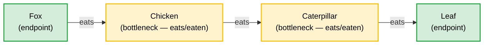
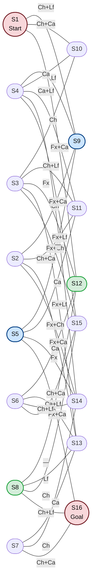

# Constraint-Graph Testbed — $P_4$ River Crossing

**Status:** Active exploration. Parts I–II complete (§1–8); Part III complete (§9–10); Part IV complete (§11–12).
**Purpose:** Extend the $P_3$ river crossing analysis to a four-object constraint graph ( $P_4$ path: Fox–Chicken–Caterpillar–Leaf). Test whether the fitness peak criterion, minimum sufficient boundary results, and OQ-DAG findings from the $P_3$ case generalise to a larger constraint graph of the same topology. The $P_3$ results are assumed known — this document records what changes and what breaks.
**Companion document:** `P_3_river_crossing.md` — all $P_3$ results referenced here are the baseline. Dependency direction: $P_3$ is the baseline; this document is the extension.

**Methods applied:**

| Method | What it does here | Part | Status |
| :--- | :--- | :--- | :--- |
| State space enumeration | Derives $\mathcal{J}^-$ and $\mathcal{J}^+$ by exhaustive application of 3 predation rules to all $2^5$ states | I | Complete |
| Transition graph construction | Maps valid states as nodes and legal Farmer moves as edges; identifies solution paths | I | Complete |
| Constraint ablation | Removes each of the 3 predation rules in isolation — establishes necessity of each | II | Complete — §7 |
| Inferential role substitution | Tests node identity failure under semantic relabelling — same label, different role | II | Complete — §6.3 |
| Cross-topology structural comparison | Compares $P_4$ results directly against $P_3$ results — tests whether the fitness peak criterion generalises | II | Complete — §8 |

**Epistemic structure:** This document uses four explicit layers. Claims do not cross layers without promotion.

| Part | Layer | Epistemic status |
| :--- | :--- | :--- |
| I — Formal record | §1–5 | Proven by enumeration only. No interpretation required. §1–5 complete. |
| II — Structural observations | §6–8 | Patterns visible in the enumerated data; not yet proved to generalise. All sections stub pending enumeration. |
| III — SIRC connections | §9–10 | Claims connecting structural observations to SIRC principles; falsifiable by Hanoi. §9: $\mathsf{P1}$ pair invariance and $\mathsf{P3}$ boundary transmission. §10: $\mathsf{P4}$ work allocation, irreducible constraint basis, node identity. |
| IV — Scope and open questions | §11–12 | What this puzzle cannot establish, and the questions it raises. |

---

## Table of Contents

| Section | Title | Part | Epistemic status |
| :--- | :--- | :--- | :--- |
| §1 | Why this puzzle | I — Formal record | Complete |
| §2 | Formal encoding | I — Formal record | Complete |
| §3 | $\mathcal{J}^-$ — the invalid states | I — Formal record | Complete — 16 invalid states enumerated |
| §4 | $\mathcal{J}^+$ — the valid states | I — Formal record | Complete — 16 valid states enumerated |
| §5 | The transition graph | I — Formal record | Complete — $b=1$ (14 edges, UNSAT), $b=2$ (32 edges, 2 paths) |
| §6 | Structural observations — bottleneck structure, solution paths, node identity | II — Structural observations | Complete — §6.1, §6.2, §6.3 |
| §7 | Minimum sufficient boundary conditions | I/II — Ablation enumeration (solver-verified) + structural observations | Complete — ablation table verified |
| §8 | Structural comparison with $P_3$ | II — Structural observations | Complete |
| §9 | $\mathsf{P1}$ and $\mathsf{P3}$ — pair invariance and boundary transmission | III — SIRC connections | Complete |
| §10 | $\mathsf{P4}$ work allocation, irreducible constraint basis, and node identity | III — SIRC connections | Complete |
| §11 | What this puzzle does not resolve | IV — Scope and open questions | Complete — 3 scope limitations |
| §12 | Open questions raised by $P_4$ | IV — Scope and open questions | Complete — 6 open questions (OQ-DAG.2, .3, .6, .7; OQ-P4.1, .2) |

---

## Notation

*Defined upfront for single-pass readers. All symbols appear in §2 or later. Readers may proceed directly to §1 and return here on first symbol encounter.*

| Symbol | Meaning | Defined |
| :--- | :--- | :--- |
| $\mathcal{S}$ | Full state space — all $2^5 = 32$ configurations $(F, \text{Fx}, \text{Ch}, \text{Ca}, \text{Lf})$ where each $\in \{L, R\}$ | §2 |
| $\mathcal{R}$ | Predation rules — the constraint packet transmitted to the receiver. Distinct from $\mathcal{J}^-$: the rules are what is transmitted; $\mathcal{J}^-$ is what they generate. Relationship: $\mathcal{J}^- = \{ s \in \mathcal{S} \mid \mathcal{R}(s) = \text{invalid} \}$ | §2 |
| $\mathcal{J}^-$ | Invalid states — configurations excluded by applying $\mathcal{R}$ to $\mathcal{S}$ | §3 |
| $\mathcal{J}^+$ | Valid states — $\mathcal{S} \setminus \mathcal{J}^-$; the state space the receiver reconstructs | §4 |
| $S_n$ | Individual state node — $S_1$ is the start state $(L,L,L,L,L)$; $S_{16}$ is the goal state $(R,R,R,R,R)$; intermediate IDs assigned in §4 | §4 |
| $e_n$ | Individual transition edge — labelled by what the Farmer carries; full enumeration in §5 | §5 |
| $\mathcal{G}_T$ | Transition graph — the undirected graph on $\mathcal{J}^+$ where nodes are valid states and edges are legal Farmer moves. Bidirectional. Distinct from the constraint graph ($P_4$ path) — see disambiguation note below. | §5 |
| $P_n$ | Path graph on $n$ nodes — $P_3$ has 3 nodes and 2 edges; $P_4$ has 4 nodes and 3 edges | §2 |
| $L_{\min}$ | Minimum solution length in moves | §5 |
| $N_{paths}$ | Number of distinct solution paths from $S_1$ to the goal state | §5 |
| $\tau(G)$ | Minimum vertex cover of the constraint graph — minimum set of objects the Farmer must always control. For $P_4$: $\tau(P_4) = 2$ (Chicken and Caterpillar) | §2 |
| $B_{unattended}$ | Set of objects on the bank where the Farmer is not present. Predation rules stated as: $\{X,Y\} \not\subseteq B_{unattended}$ | §2 |
| $\mathsf{P1}$, $\mathsf{P3}$, $\mathsf{P4}$ | SIRC Principles — P1 (Invariance), P3 (Constraint Packet), P4 (Work Allocation). Full definitions in `SIRC_principles/SIRC_principles.md` | Part III |

**Disambiguation note — two graphs, not one:** This document contains two distinct graph objects. The **constraint graph** ( $P_4$ path: Fx–Ch–Ca–Lf) is $\mathcal{R}$ — its nodes are transported objects and its edges are predation relations ("eats"). The **transition graph** ( $\mathcal{G}_T$) has valid states as nodes and legal Farmer moves as edges. These are different mathematical objects: different nodes, different edge types, different epistemic roles. The constraint graph is $\mathsf{P3}$'s object (the transmitted packet); the transition graph is $\mathsf{P4}$'s object (the receiver's work). Conflating the two is a categorical error. See R4 in `constraint-graph_testbed_retraction.md`.

---

## Part I — Formal record

*Sections §1–5. Proven by enumeration only. No interpretation required.*

### §1. Why this puzzle

The $P_3$ river crossing established that the SIRC constraint framework is coherent on a 3-node path constraint graph. Three specific results were produced:

1. **Fitness peak** ($P_3$ doc §10.1): $P_3$ is the unique 3-node constraint graph at the boundary between trivial and unsolvable. The "connected but not complete" criterion describes this boundary for N=3.
2. **Minimum sufficient boundary** ($P_3$ doc §7): 2 predation rules are necessary and sufficient. Removing either degrades the puzzle; adding a third disconnects the reachable subgraph.
3. **Two solution paths** ($P_3$ doc §6.2): $P_3$ produces exactly 2 solution paths sharing a common trunk. The question of which subgraph is the invariant is raised but not resolved.

$P_4$ tests all three results under a one-step increase in constraint graph size. The constraint graph gains one node and one edge; the constraint type (pair exclusion, unattended bank) is unchanged. This isolates the effect of graph size from the effect of constraint type, but not from required boat capacity: $P_3$ is solvable at $b=1$; $P_4$ requires $b=2$ (§5, §6.1). The capacity increase is a structural consequence of the larger minimum vertex cover ($\tau(P_4)=2$ vs $\tau(P_3)=1$), not a separately varied parameter.

**Four questions this document investigates (not all answered — see §12 for scope):**

1. **Does the fitness peak criterion generalise, or does it reduce to an irreducible lower boundary?** For N=4, is the $P_4$ path the unique constraint graph at the lower boundary of a solvable region, or does the boundary condition change character? *(Investigated in §7–8; deferred to OQ-DAG.2 — see §12.)*
2. **How many solution paths does $P_4$ produce, and what is the trunk structure?** $P_3$ produces exactly 2, sharing a common trunk. $P_4$ has two bottleneck nodes (Chicken and Caterpillar). §5 establishes $N_{paths}=2$; §6 analyses the trunk structure.
3. **Does cultural universality extend to $P_4$?** If $P_4$'s irreducible constraint structure places it at a tractable-but-non-trivial sweet spot, independently invented $P_4$ puzzles should exist across cultures. No cultural instances are documented in this series — but the absence cannot distinguish a cognitive-load threshold from an incomplete survey. *(Cultural survey not conducted in this experiment; open question in OQ-DAG.7, §12.)*
4. **What happens to solution depth at $N=4$?** $P_3$ requires $L_{\min}=7$ moves at $b=1$. $P_4$ is UNSAT at $b=1$; at $b=2$, $L_{\min}=3$. Solution depth decreases despite the larger puzzle. §8 documents the prediction failure and provides the structural explanation: the two safe pairs matching the boat capacity eliminate all return-cargo moves.

---

### §2. Formal encoding

**Five objects:** Farmer (F), Fox (Fx), Chicken (Ch), Caterpillar (Ca), Leaf (Lf).
Each object is on either bank: L (left, start) or R (right, goal).
**State Space:** $\mathcal{S} = \{ (F, \text{Fx}, \text{Ch}, \text{Ca}, \text{Lf}) \mid F, \text{Fx}, \text{Ch}, \text{Ca}, \text{Lf} \in \{L, R\} \}$, where $|\mathcal{S}| = 2^5 = 32$.

**Move rule:** Farmer must move on every turn (to the opposite bank). Farmer may bring at most $b$ other objects from their current bank, where $b$ is the boat capacity.

**Move rule (formal):** Let $\overline{b}$ denote the opposite of bank $b$. A transition from state $s$ to state $s'$ is legal if and only if:

$$F_{s'} = \overline{F_s}$$

and there exists a set $X \subseteq \{o \in \{\text{Fx}, \text{Ch}, \text{Ca}, \text{Lf}\} \mid o_s = F_s\}$ with $|X| \leq b$ such that:

- $\forall o \in X,\; o_{s'} = \overline{o_s}$ (carried objects cross with the Farmer)
- $\forall o \notin X,\; o_{s'} = o_s$ (all other objects stay)

In words: the Farmer always crosses; at most $b$ objects on the Farmer's current bank may cross with him; all other objects stay. This transition function, applied to $\mathcal{J}^+$, generates the edge set of the transition graph — independently derivable from the notation without the §5 edge table. This document analyses $b=1$ and $b=2$; §5 contains both edge tables.

**Safety rule (the boundary conditions):**
On any bank where the farmer is **not** present:
- Fox and Chicken cannot coexist. (Fx eats Ch.)
- Chicken and Caterpillar cannot coexist. (Ch eats Ca.)
- Caterpillar and Leaf cannot coexist. (Ca eats Lf.)

These three rules are the **constraint packet $\mathcal{R}$** — the rules that generate the invalid states $\mathcal{J}^-$. The relationship between the three sets is:

$$\mathcal{J}^- = \{ s \in \mathcal{S} \mid \mathcal{R}(s) = \text{invalid} \}, \qquad \mathcal{J}^+ = \mathcal{S} \setminus \mathcal{J}^-$$

$\mathcal{R}$ is what is transmitted; $\mathcal{J}^-$ is what it generates; $\mathcal{J}^+$ is what the receiver reconstructs.

**Internal consistency protocol:** The four formal elements above (state space, move rule, constraint packet, set relationships) are the complete specification of the puzzle. A reader or auditor can verify §3–§5 independently:
- Apply $\mathcal{R}$ to all $2^5 = 32$ states in $\mathcal{S}$ → must produce exactly the §3 invalid-state enumeration.
- $\mathcal{J}^+ = \mathcal{S} \setminus \mathcal{J}^-$ → must match the §4 valid-state list exactly.
- Apply the move rule to all states in $\mathcal{J}^+$ at each capacity variant → must produce exactly the §5 edge tables.

Any mismatch is a document inconsistency. Resolve by correcting §2, then re-deriving the downstream tables — not the reverse.

**The constraint graph:**

*$P_4$ has two bottleneck nodes (orange) — Chicken and Caterpillar each appear in two unsafe pairs. $P_3$ had one (Goat). The structural consequence for solution path count and shared trunk structure is established in §5–6.*

**Precision note — vertex cover vs. minimum sufficient boundary:**

For $P_4$ (Fx–Ch–Ca–Lf), $\tau(P_4) = 2$: the minimum vertex cover is $\{\text{Chicken, Caterpillar}\}$ — these two nodes together cover all three edges. The Alcuin number result ( $\tau(G) \leq \text{Alcuin}(G) \leq \tau(G) + 1$) sets minimum boat capacity at 2 or 3 items. The minimum sufficient boundary is 3 rules.

| Measure | $P_3$ | $P_4$ | Formula for $P_n$ |
|---|---|---|---|
| $\tau(G)$ — minimum vertex cover (boat capacity) | 1 | 2 | $\lfloor n/2 \rfloor$ |
| Minimum sufficient boundary (rule count) | 2 | 3 | $n-1$ |

**Comparison to $P_3$ encoding:**

| Property | $P_3$ | $P_4$ |
|---|---|---|
| Transported objects | 3 (W, G, C) | 4 (Fx, Ch, Ca, Lf) |
| Total objects (incl. Farmer) | 4 | 5 |
| Total state space | $2^4$ = 16 | $2^5$ = 32 |
| Predation rules ( $\mathcal{R}$ generators) | 2 | 3 |
| Bottleneck nodes | 1 (Goat) | 2 (Chicken, Caterpillar) |
| Endpoint nodes | 2 (Wolf, Cabbage) | 2 (Fox, Leaf) |

---

### §3. $\mathcal{J}^-$ — the invalid states

$|\mathcal{J}^-| = 16$. Enumerated by applying $\mathcal{R}$ to all 32 states in $\mathcal{S}$. Same for both capacity variants — capacity affects move options, not state validity.

| State $(F,\text{Fx},\text{Ch},\text{Ca},\text{Lf})$ | Unattended bank | Violated rule(s) |
| :--- | :--- | :--- |
| $(L,L,L,R,R)$ | $\{\text{Ca},\text{Lf}\}$ | Ca eats Lf |
| $(L,L,R,R,L)$ | $\{\text{Ch},\text{Ca}\}$ | Ch eats Ca |
| $(L,L,R,R,R)$ | $\{\text{Ch},\text{Ca},\text{Lf}\}$ | Ch eats Ca; Ca eats Lf |
| $(L,R,L,R,R)$ | $\{\text{Fx},\text{Ca},\text{Lf}\}$ | Ca eats Lf |
| $(L,R,R,L,L)$ | $\{\text{Fx},\text{Ch}\}$ | Fx eats Ch |
| $(L,R,R,L,R)$ | $\{\text{Fx},\text{Ch},\text{Lf}\}$ | Fx eats Ch |
| $(L,R,R,R,L)$ | $\{\text{Fx},\text{Ch},\text{Ca}\}$ | Fx eats Ch; Ch eats Ca |
| $(L,R,R,R,R)$ | $\{\text{Fx},\text{Ch},\text{Ca},\text{Lf}\}$ | Fx eats Ch; Ch eats Ca; Ca eats Lf |
| $(R,L,L,L,L)$ | $\{\text{Fx},\text{Ch},\text{Ca},\text{Lf}\}$ | Fx eats Ch; Ch eats Ca; Ca eats Lf |
| $(R,L,L,L,R)$ | $\{\text{Fx},\text{Ch},\text{Ca}\}$ | Fx eats Ch; Ch eats Ca |
| $(R,L,L,R,L)$ | $\{\text{Fx},\text{Ch},\text{Lf}\}$ | Fx eats Ch |
| $(R,L,L,R,R)$ | $\{\text{Fx},\text{Ch}\}$ | Fx eats Ch |
| $(R,L,R,L,L)$ | $\{\text{Fx},\text{Ca},\text{Lf}\}$ | Ca eats Lf |
| $(R,R,L,L,L)$ | $\{\text{Ch},\text{Ca},\text{Lf}\}$ | Ch eats Ca; Ca eats Lf |
| $(R,R,L,L,R)$ | $\{\text{Ch},\text{Ca}\}$ | Ch eats Ca |
| $(R,R,R,L,L)$ | $\{\text{Ca},\text{Lf}\}$ | Ca eats Lf |

---

### §4. $\mathcal{J}^+$ — the valid states

$|\mathcal{J}^+| = 16$. $\mathcal{J}^+ = \mathcal{S} \setminus \mathcal{J}^-$. Same for both capacity variants.

| $S_n$ | State $(F,\text{Fx},\text{Ch},\text{Ca},\text{Lf})$ | Role |
| :--- | :--- | :--- |
| $S_1$ | $(L,L,L,L,L)$ | Start state |
| $S_2$ | $(L,L,L,L,R)$ | |
| $S_3$ | $(L,L,L,R,L)$ | |
| $S_4$ | $(L,L,R,L,L)$ | |
| $S_5$ | $(L,L,R,L,R)$ | Path 2 midpoint |
| $S_6$ | $(L,R,L,L,L)$ | |
| $S_7$ | $(L,R,L,L,R)$ | |
| $S_8$ | $(L,R,L,R,L)$ | Path 1 midpoint |
| $S_9$ | $(R,L,R,L,R)$ | Path 2 after move 1 |
| $S_{10}$ | $(R,L,R,R,L)$ | |
| $S_{11}$ | $(R,L,R,R,R)$ | |
| $S_{12}$ | $(R,R,L,R,L)$ | Path 1 after move 1 |
| $S_{13}$ | $(R,R,L,R,R)$ | |
| $S_{14}$ | $(R,R,R,L,R)$ | |
| $S_{15}$ | $(R,R,R,R,L)$ | |
| $S_{16}$ | $(R,R,R,R,R)$ | Goal state |

---

### §5. The transition graph

**Aggregate metrics:**

| Metric | $b=1$ | $b=2$ |
| :--- | :--- | :--- |
| $\|\mathcal{J}^+\|$ | 16 | 16 |
| Edges $\|\mathcal{G}_T\|$ | 14 | 32 |
| $N_{paths}$ | 0 (UNSAT) | 2 |
| $L_{\min}$ | — | 3 |

**$b=1$ — UNSAT.** $S_1$ and $S_{16}$ have no edges in the $b=1$ transition graph — they are isolated from all other valid states. Start and goal are in disconnected components; no solution can exist. Z3 confirms UNSAT at all $k \leq 20$.

**$b=1$ edge table (14 edges — does not connect $S_1$ or $S_{16}$):**

| Edge | States | Farmer carries |
| :--- | :--- | :--- |
| $e_1$ | $S_2 — S_9$ | Ch |
| $e_2$ | $S_3 — S_{10}$ | Ch |
| $e_3$ | $S_3 — S_{12}$ | Fx |
| $e_4$ | $S_4 — S_9$ | Lf |
| $e_5$ | $S_4 — S_{10}$ | Ca |
| $e_6$ | $S_5 — S_9$ | Nothing |
| $e_7$ | $S_5 — S_{11}$ | Ca |
| $e_8$ | $S_5 — S_{14}$ | Fx |
| $e_9$ | $S_6 — S_{12}$ | Ca |
| $e_{10}$ | $S_7 — S_{13}$ | Ca |
| $e_{11}$ | $S_7 — S_{14}$ | Ch |
| $e_{12}$ | $S_8 — S_{12}$ | Nothing |
| $e_{13}$ | $S_8 — S_{13}$ | Lf |
| $e_{14}$ | $S_8 — S_{15}$ | Ch |

**$b=2$ edge table (32 edges):**

| Edge | States | Farmer carries |
| :--- | :--- | :--- |
| $e_1$ | $S_1 — S_9$ | Ch+Lf — Path 2, move 1 |
| $e_2$ | $S_1 — S_{10}$ | Ch+Ca |
| $e_3$ | $S_1 — S_{12}$ | Fx+Ca — Path 1, move 1 |
| $e_4$ | $S_2 — S_9$ | Ch |
| $e_5$ | $S_2 — S_{11}$ | Ch+Ca |
| $e_6$ | $S_2 — S_{13}$ | Fx+Ca |
| $e_7$ | $S_2 — S_{14}$ | Fx+Ch |
| $e_8$ | $S_3 — S_{10}$ | Ch |
| $e_9$ | $S_3 — S_{11}$ | Ch+Lf |
| $e_{10}$ | $S_3 — S_{12}$ | Fx |
| $e_{11}$ | $S_3 — S_{13}$ | Fx+Lf |
| $e_{12}$ | $S_3 — S_{15}$ | Fx+Ch |
| $e_{13}$ | $S_4 — S_9$ | Lf |
| $e_{14}$ | $S_4 — S_{10}$ | Ca |
| $e_{15}$ | $S_4 — S_{11}$ | Ca+Lf |
| $e_{16}$ | $S_4 — S_{14}$ | Fx+Lf |
| $e_{17}$ | $S_4 — S_{15}$ | Fx+Ca |
| $e_{18}$ | $S_5 — S_9$ | Nothing — Path 2, move 2 (return) |
| $e_{19}$ | $S_5 — S_{11}$ | Ca |
| $e_{20}$ | $S_5 — S_{14}$ | Fx |
| $e_{21}$ | $S_5 — S_{16}$ | Fx+Ca — Path 2, move 3 |
| $e_{22}$ | $S_6 — S_{12}$ | Ca |
| $e_{23}$ | $S_6 — S_{13}$ | Ca+Lf |
| $e_{24}$ | $S_6 — S_{14}$ | Ch+Lf |
| $e_{25}$ | $S_6 — S_{15}$ | Ch+Ca |
| $e_{26}$ | $S_7 — S_{13}$ | Ca |
| $e_{27}$ | $S_7 — S_{14}$ | Ch |
| $e_{28}$ | $S_7 — S_{16}$ | Ch+Ca |
| $e_{29}$ | $S_8 — S_{12}$ | Nothing — Path 1, move 2 (return) |
| $e_{30}$ | $S_8 — S_{13}$ | Lf |
| $e_{31}$ | $S_8 — S_{15}$ | Ch |
| $e_{32}$ | $S_8 — S_{16}$ | Ch+Lf — Path 1, move 3 |

**Solution paths ($b=2$, $L_{\min}=3$, $N_{paths}=2$):**

**Path 1:** $S_1 \to S_{12} \to S_8 \to S_{16}$
- Move 1: $S_1 \to S_{12}$ via $e_3$ — carry Fx+Ca (Fox+Caterpillar)
- Move 2: $S_{12} \to S_8$ via $e_{29}$ — carry Nothing (return alone)
- Move 3: $S_8 \to S_{16}$ via $e_{32}$ — carry Ch+Lf (Chicken+Leaf)

**Path 2:** $S_1 \to S_9 \to S_5 \to S_{16}$
- Move 1: $S_1 \to S_9$ via $e_1$ — carry Ch+Lf (Chicken+Leaf)
- Move 2: $S_9 \to S_5$ via $e_{18}$ — carry Nothing (return alone)
- Move 3: $S_5 \to S_{16}$ via $e_{21}$ — carry Fx+Ca (Fox+Caterpillar)

Both paths transport the same two object pairs: $\{\text{Fx}, \text{Ca}\}$ and $\{\text{Ch}, \text{Lf}\}$. These are the two non-adjacent pairs in the $P_4$ constraint graph — no predation edge connects Fox to Caterpillar, and none connects Chicken to Leaf. Path 1 takes $\{\text{Fx},\text{Ca}\}$ first; Path 2 takes $\{\text{Ch},\text{Lf}\}$ first. The two paths are structural reverses of each other.

**$b=2$ transition graph** (nodes coloured by path role; path edges are $e_1, e_3, e_{18}, e_{21}, e_{29}, e_{32}$):

---

## Part II — Structural observations

*Sections §6–8. Patterns observable in enumerated data; not yet proved to generalise beyond this puzzle.*

### §6. Structural observations — bottleneck structure, solution paths, node identity

#### §6.1 Bottleneck structure and the $b=1$ UNSAT result

$P_4$ has two bottleneck nodes: Chicken (Ch) and Caterpillar (Ca). Each appears in two predation rules: Ch in $\{\text{Fx},\text{Ch}\}$ and $\{\text{Ch},\text{Ca}\}$; Ca in $\{\text{Ch},\text{Ca}\}$ and $\{\text{Ca},\text{Lf}\}$. The minimum vertex cover is $\tau(P_4) = 2$ — both Ch and Ca must be controlled simultaneously to suppress all three predation rules.

This has a direct consequence for capacity. The Farmer must carry at least one object from the vertex cover on every move — otherwise the unattended bank retains both bottleneck nodes and at least one predation rule is active. With $b=1$, the Farmer cannot remove both bottleneck nodes from any bank in a single move. The result: $S_1$ and $S_{16}$ have no edges in the $b=1$ transition graph (§5). The puzzle is UNSAT at $b=1$ because of its graph structure, not because BFS found no path. The Alcuin lower bound proves this before any search is run: since $\tau(P_4) = 2$, the theorem gives $\text{Alcuin}(P_4) \geq 2$, establishing $b=1$ as insufficient. The $S_1/S_{16}$ isolation confirmed in §5 is the empirical validation of a theoretically guaranteed result.

At $b=2$, the Farmer can carry both bottleneck-adjacent pairs simultaneously. Both solution paths use this: move 1 carries one non-adjacent pair (either $\{\text{Fx},\text{Ca}\}$ or $\{\text{Ch},\text{Lf}\}$), each containing one bottleneck object removed from the starting bank. The Alcuin number result ($\tau(G) \leq \text{Alcuin}(G) \leq \tau(G)+1$) correctly bounds the minimum workable capacity at $b \in \{2,3\}$; §5 confirms $b=2$ is sufficient.

#### §6.2 Solution path structure — reversal symmetry

$P_3$ §6.2 predicted that two bottleneck nodes should produce more than two solution paths, on the basis that each bottleneck node generates an independent branching state. $P_4$ §5 falsifies this prediction: $N_{paths} = 2$.

The reason: the two bottleneck nodes (Ch and Ca) are *adjacent* in the $P_4$ constraint graph. They are not independent sources of free choice — they form a contiguous constraint chain (Fx–Ch–Ca–Lf). The safe pairings are the two non-adjacent object pairs, $\{\text{Fx},\text{Ca}\}$ and $\{\text{Ch},\text{Lf}\}$, which must be transported as units. There is no state in the $b=2$ transition graph where the Farmer can choose independently between Ch and Ca — both must be managed together.

Both solution paths transport the same two pairs. The two paths are structural reverses: Path 1 takes $\{\text{Fx},\text{Ca}\}$ first; Path 2 takes $\{\text{Ch},\text{Lf}\}$ first. The midpoint states ($S_{12}$ and $S_9$ respectively) are symmetric — each has two safe objects on each bank. There is no trunk in the $P_3$ sense (a shared sequence of forced moves through a single bottleneck). The two paths are wholly disjoint except at $S_1$ and $S_{16}$.

**Revised prediction for $P_5$:** If the constraint graph grows to Fx–Ch–Ca–Lf–$X_5$ (adding a fifth object predated by Lf), the additional bottleneck creates a new non-adjacent pairing structure. Whether the reversal symmetry holds at $N=5$ is open — see §12.

#### §6.3 Node identity — constraint role (the testbed proxy for $\mathsf{P1}$'s inferential role)

Nodes in the $P_4$ transition graph are identifiable by their neighbourhood without reference to state labels — the same result as $P_3$ §8.1. The reversal symmetry in §6.2 raises an apparent concern: $S_{12}$ (Path 1 midpoint) and $S_9$ (Path 2 midpoint) have symmetric structural roles. Are they distinguishable?

They are. $S_{12}$ connects to $\{S_1, S_8, S_3, S_6, ...\}$; $S_9$ connects to $\{S_1, S_5, S_2, S_4, ...\}$. Different neighbourhoods — different identities. The reversal symmetry means the two paths have analogous structure, not that any two corresponding states are indistinguishable.

The endpoint objects (Fx and Lf) are symmetric in the $P_4$ constraint graph — each appears in exactly one predation rule. Swapping their labels (Fx↔Lf) produces a constraint graph with the same topology. This particular label permutation does not produce a node identity failure. A failure requires changing the *role* of an object — specifically, the set of pairs it makes unsafe — not merely renaming symmetric objects within a structure that accommodates the swap.

However, the full graph symmetry is stronger than the Fx↔Lf swap alone. The permutation $\sigma: (\text{Fx} \leftrightarrow \text{Lf}, \text{Ch} \leftrightarrow \text{Ca})$ maps $\mathcal{R}$ to itself: $\sigma(\{\text{Fx},\text{Ch}\}) = \{\text{Lf},\text{Ca}\}$, $\sigma(\{\text{Ch},\text{Ca}\}) = \{\text{Ca},\text{Ch}\}$, $\sigma(\{\text{Ca},\text{Lf}\}) = \{\text{Ch},\text{Fx}\}$ — these are the same three rules reordered. Because $\sigma(\mathcal{R}) = \mathcal{R}$, Ch and Ca are structurally indistinguishable in the unlabelled constraint graph. Distinguishing Ch from Ca by neighbourhood ("Ch is adjacent to Fx") presupposes that the receiver already knows which degree-1 node is Fx and which is Lf — knowledge that $\mathsf{P1}$ frames as surface form, not constraint-packet content. The distinction between Ch and Ca is therefore not achievable from constraint-packet topology alone if labels are treated as surface form.

The full analysis of nomenclature mismatch and its consequences for $\mathsf{P1}$ is deferred to Part III.

---

### §7. Minimum sufficient boundary conditions (ablation)

**The 3 predation rules are the minimum sufficient boundary conditions $\mathcal{R}$ for this puzzle ($b=2$).**

All values by exhaustive BFS enumeration with assertions in `verify_puzzle.py`.

| Operation | $\|\mathcal{R}\|$ | $\|\mathcal{J}^-\|$ | $\|\mathcal{J}^+\|$ | Edges | $N_{paths}$ | $L_{\min}$ | Status |
| :--- | :---: | :---: | :---: | :---: | :---: | :---: | :--- |
| Baseline (all 3 rules) | 3 | 16 | 16 | 32 | 2 | 3 | Irreducible constraint set candidate — non-trivial, solvable |
| Remove $\{\text{Fx},\text{Ch}\}$ (endpoint) | 2 | 12 | 20 | 42 | 2 | 3 | Degraded — 4 fewer invalid states |
| Remove $\{\text{Ch},\text{Ca}\}$ (middle) | 2 | 14 | 18 | 40 | 4 | 3 | Degraded — $N_{paths}$ doubles (2→4); central constraint suppressed |
| Remove $\{\text{Ca},\text{Lf}\}$ (endpoint) | 2 | 12 | 20 | 42 | 2 | 3 | Degraded — symmetric to endpoint removal above |
| Remove all 3 | 0 | 0 | 32 | 72 | 6 | 3 | Trivial — no strategy required |
| Add $\{\text{Fx},\text{Lf}\}$ (4th rule) | 4 | 18 | 14 | 26 | 2 | 3 | Over-constrained — solvable (contrast with $P_3$) |

**Necessity (invalid-state structure):** All three rules are individually necessary to maintain the invalid-state structure. Removing any rule changes $|\mathcal{J}^-|$: endpoint removal drops it from 16 to 12; middle rule removal drops it from 16 to 14.

**Necessity (solution character):** The endpoint rules and the middle rule are not equivalent here. Removing either endpoint rule preserves $L_{\min}=3$ and $N_{paths}=2$ — the solution character is unchanged. Removing the middle rule increases $N_{paths}$ from 2 to 4. The middle rule is necessary in both senses; the endpoint rules are necessary only to maintain $|\mathcal{J}^-|=16$.

**Sufficiency:** Together the three rules uniquely determine $|\mathcal{J}^-|=16$, $|\mathcal{J}^+|=16$, $N_{paths}=2$, $L_{\min}=3$.

**Middle rule asymmetry:** The $\{\text{Ch},\text{Ca}\}$ rule occupies the central edge of the $P_4$ path — the only edge connecting both bottleneck nodes. Its removal has a different structural consequence from either endpoint rule: $N_{paths}$ increases to 4 (not 2), and $|\mathcal{J}^-|$ drops by only 2 (not 4). The central edge suppresses a qualitatively distinct class of invalid states. This asymmetry has no analogue in $P_3$, which has no middle rule.

**Contrast with $P_3$:** $P_3$ §7 shows that adding a third rule to $P_3$ ({W,C}) produces UNSAT. Adding a fourth rule to $P_4$ ($\{\text{Fx},\text{Lf}\}$, connecting the two endpoints) does not produce UNSAT — the puzzle remains solvable with $N_{paths}=2$. The constraint graph with this fourth rule is a $C_4$ cycle (Fx–Ch–Ca–Lf–Fx), not a complete graph. The over-constraint threshold for $P_4$ is higher than for $P_3$. What rule addition would tip $P_4$ to UNSAT is an open question (§12).

---

### §8. Structural comparison with $P_3$

| Property | $P_3$ result | $P_4$ conjecture | $P_4$ confirmed |
| :--- | :--- | :--- | :--- |
| Invalid states $\|\mathcal{J}^-\|$ | 6 | $> 6$ | **16** ✓ |
| Valid states $\|\mathcal{J}^+\|$ | 10 | $< 26$ | **16** ✓ (grows by 6 despite state space doubling) |
| Predation rules $\|\mathcal{R}\|$ (minimum sufficient) | 2 | 3 | **3** ✓ |
| Solution paths $N_{paths}$ | 2 | $> 2$ | **2** — prediction wrong; see §6.2 |
| Shared trunk nodes | 6 ($S_1,S_6,S_3,S_8,S_5,S_{10}$) | Unknown | **2** ($S_1$ and $S_{16}$ only) — no interior trunk |
| Minimum solution length $L_{\min}$ | 7 moves ($b=1$) | Informal assumption: $> 7$ (not from $P_3$ §6.2; $P_3$ §15.1 tabulated $L_{\min}=3$ at $b=2$) | **3 moves** ($b=2$) — consistent with $P_3$ §15.1; structural explanation in prose |
| Bottleneck nodes $\tau(G)$ | 1 (Goat) | 2 (Ch, Ca) | **2** ✓ — confirmed by construction |
| Fitness peak criterion | Yes — over-constraint → UNSAT | Conjecture: yes | **Fails (two-sided peak)** — over-constraint does not produce UNSAT; **Holds (irreducible basis)** — all rules strictly necessary |

**One prediction failure and two structural findings:**

1. **$N_{paths}=2$, not $>2$.** At $N=4$, adjacent bottleneck nodes (Ch and Ca form a contiguous chain) appear to act as a unit, not as independent branching sources — the P_3 reasoning (more bottlenecks → more branching) does not hold here. *Candidate: whether this is a property of adjacency in general, or specific to the $P_4$ two-chain, is falsifiable at $N=5$ if adjacent bottleneck nodes in a longer chain produce independent branching.*

2. **$L_{\min}=3$ (below informal assumption of $>7$; already tabulated in $P_3$ §15.1).** The comparison is not equivalent: P_3 requires $b=1$; P_4 requires $b=2$. Higher capacity allows the Farmer to transport both non-adjacent safe pairs in a single move each way, collapsing 7 moves to 3. The minimum solution length is a function of both constraint graph structure and minimum sufficient capacity — not of constraint graph structure alone. The "$>7$ moves" assumption was not a formal $P_3$ §6.2 conjecture; $P_3$ §15.1 had already recorded $L_{\min}=3$ at $b=2$ as a scope extension. The structural explanation for the collapse is the relevant finding here.

3. **No shared trunk (unexpected finding — trunk was not conjectured; table conjecture: Unknown).** P_3's trunk reflects the single bottleneck forcing the Farmer through a fixed sequence. P_4's two-bottleneck reversal symmetry produces wholly disjoint paths — there is no forced shared sub-sequence. At $N \in \{3, 4\}$, the trunk appears as a property of single-bottleneck puzzles and is absent in two-bottleneck cases. *Candidate: the trunk may be a property of single-bottleneck path graphs. Falsifiable if a multi-bottleneck path puzzle is found with a non-trivial shared interior trunk, or if a single-bottleneck puzzle at $N > 3$ lacks one.*

---

## Part III — SIRC connections

*Candidate claims connecting structural observations to SIRC principles. Each is falsifiable by Hanoi and C_6. Promotion conditions from $P_3$ §9–12 are stated explicitly; results below report whether each condition was met.*

---

### §9. $\mathsf{P1}$ and $\mathsf{P3}$ — pair invariance and boundary transmission

**Testbed scope — §9 results are constraint-satisfaction bounds, not $\mathsf{P1}$ findings**

$\mathsf{P1}$ requires a typed directed DAG: entailment relations ($\Gamma \vdash C$), operator types (AND, OR, NOT), and directed consequence flow (`SIRC_principles.md` §P1, items 1–3 — "the transmitted object is a typed DAG, not a bare topology"). River crossing predation rules are undirected symmetric pair-exclusion constraints ($\{X, Y\} \not\subseteq B_\text{unattended}$): no premises, no conclusions, no operators, no directed flow. The testbed models a constraint-satisfaction relaxation of $\mathsf{P1}$'s requirements, not $\mathsf{P1}$ itself.

Results in this section therefore establish two types of finding: (a) properties that *fail* under undirected constraints identify what directed, typed structure is *necessary* for $\mathsf{P1}$; (b) properties that *hold* under undirected constraints are lower-bound Candidates — they may survive in $\mathsf{P1}$-proper instances but are not confirmed until tested in a directed typed system.

OQ1.4 (`SIRC_principles.md` §P1) is the unresolved resolution path: if inferential role is defined by syntactic graph position (inference-system-independent) rather than $(\Gamma, C)$ entailment pairs, undirected constraint-graph results would approach $\mathsf{P1}$-validity. Until OQ1.4 resolves, the directed-consequence reading is canonical, and the gap between these results and $\mathsf{P1}$-proper claims remains.

*$\mathsf{P3}$ scope note: the §9 $\mathsf{P3}$ claim (constraint-packet sufficiency for $\mathcal{J}^+$ reconstruction) is a packet completeness question in a finite-CSP setting — it does not depend on directed consequence structure and is not affected by the above.*

#### $\mathsf{P1}$ — sequence hypothesis falsified; pair-membership invariant is Candidate

$P_3$ §9 states the falsification condition: "if $P_4$'s $\mathcal{R}$ does not force a unique bottleneck management sequence shared across all solution paths — some $P_4$ solution paths do not exhibit the same set of $\mathcal{R}$-forced conclusions as others — then the forced-conclusion invariant is an artefact of $P_3$'s single-bottleneck topology."

**The condition is met.** $P_4$ has no shared trunk (§6.2, §8) and no forced ordering — both $\{\text{Fx},\text{Ca}\}$-first (Path 1) and $\{\text{Ch},\text{Lf}\}$-first (Path 2) are valid. $\mathcal{R}$ does not force which pair moves first. The $P_3$ §9 sequence hypothesis is **falsified**.

**Separate observation (Candidate):** $\mathcal{R}$ does force pair membership — both paths transport exactly the same two object pairs $\{\text{Fx},\text{Ca}\}$ and $\{\text{Ch},\text{Lf}\}$. This is a distinct structural finding: $\mathcal{R}$ constrains *which objects move together* even when it cannot constrain ordering. Note: "R-forced" here means what $\mathcal{R}$ logically mandates about valid pair configurations, not that the solution paths are themselves entailment structures. The $\mathcal{R}$-forced conclusion set at $P_4$ is:

- Safe pairings are $\{\text{Fx},\text{Ca}\}$ and $\{\text{Ch},\text{Lf}\}$ — each must be transported as a unit
- Both bottleneck nodes must be controlled on every move
- Ordering between the two pairs is free

Whether pair-membership constraint constitutes a meaningful $\mathsf{P1}$ invariant is a reformulation of the original claim — not a promotion of it. This is **Candidate**, contingent on whether $\mathsf{P1}$ (OQ1.1) operates over conclusion sets or over structural sequences. If $\mathsf{P1}$ requires sequence isomorphism, the pair-membership finding does not make contact. If $\mathsf{P1}$ operates over conclusion sets, the finding is relevant.

This makes OQ1.1 ([SIRC_principles.md](SIRC_principles.md) §P1 — whether the invariant requires minimal dependency structure or permits equivalent non-minimal derivations) more concrete at $N=4$: two receivers reconstructing different orderings from the same $\mathcal{R}$ both reconstruct the same forced-pairing conclusions but different path sequences. If $\mathsf{P1}$ is defined over the conclusion set, both paths are $\mathsf{P1}$-equivalent. If it requires structural isomorphism of the reconstruction sequence, they are not.

**Falsification condition for further generalisation:** If $P_5$ or another multi-path puzzle ($N_{paths} > 1$ required) produces solution paths where different paths exhibit *different* $\mathcal{R}$-forced conclusions — some paths require a move that others do not — then the forced-conclusion invariant does not hold across all path-graph puzzles and the Candidate status of the pair-membership invariant is topology-specific. (Hanoi's minimal transition graph has $N_{paths}=1$ — a unique shortest solution — and cannot test path-to-path conclusion divergence; $P_5$ river crossing is the applicable next testbed.)

#### $\mathsf{P3}$ — Candidate (finite exhaustion)

$P_3$ §10 states the promotion condition: "if a receiver given only the $P_4$ predation rules can derive $\mathcal{J}^+$ by exhaustive exclusion alone."

The condition is met. A receiver given the three $P_4$ predation rules can apply them to all 32 states by exhaustion and recover exactly $|\mathcal{J}^+| = 16$ (§3–4). No valid states need to be provided as starting points. $\mathcal{R}$-only transmission is sufficient for $\mathcal{J}^+$ reconstruction at $N=4$.

The $P_3$ §10 claim is confirmed at $N=3$ and $N=4$ by exhaustive enumeration — a definitional consequence of $\mathcal{J}^+ = \mathcal{S} \setminus \mathcal{J}^-$: applying $\mathcal{R}$ to a finite $\mathcal{S}$ recovers $\mathcal{J}^+$ by construction wherever $\mathcal{R}$ fully determines $\mathcal{J}^-$. The two-instance pattern within the same puzzle family is **Candidate** — not a confirmed structural property — per SIRC verification asymmetry.

**Falsification condition for further generalisation:** For a receiver who already possesses the game substrate (state space definition, Farmer mechanics, universe size), $\mathcal{R}$-only sufficiency cannot fail by reconstruction ambiguity — $\mathcal{J}^+ = \mathcal{S} \setminus \mathcal{J}^-$ is computable by deterministic exhaustion. The real boundary is background assumption dependence: if for some constraint type (e.g. Hanoi's ordering constraints) a receiver who knows only $\mathcal{R}$ but not the full substrate cannot recover $\mathcal{J}^+$ without additional information, then $\mathcal{R}$-only transmission requires the substrate to be separately available. Whether the game substrate should count as part of the constraint packet or as independent receiver capacity is the open question this claim depends on.

---

### §10. $\mathsf{P4}$ work allocation, irreducible constraint basis, and node identity

#### $\mathsf{P4}$ — no promotion warranted; Candidate

$P_3$ §11 states the promotion condition: $|\mathcal{J}^+|/|\mathcal{R}| > 5$ (valid states per rule exceeds the $P_3$ baseline of $10/2 = 5$).

The condition is barely met: $|\mathcal{J}^+|/|\mathcal{R}| = 16/3 \approx 5.33$. The transition graph grows substantially — 32 edges at $b=2$ vs 10 edges at $P_3$ — as does the state space (32 total states vs 16). Both measures of receiver search grow faster than the constraint packet.

*Metric note: $|\mathcal{J}^+|/|\mathcal{R}|$ is a naive enumeration ratio — valid states over rule count in the full state space. SIRC $\mathsf{P4}$ explicitly states its inverse coupling operates on the space of states that survive constraint propagation, not the naive enumeration space. This ratio is used here as the $P_3$ §11 baseline comparison only; it does not constitute a $\mathsf{P4}$-compliant work measure. The $L_{\min}$ collapse (7→3) is the more $\mathsf{P4}$-relevant signal: it reflects actual reduction in receiver search depth under minimum-capacity constraint propagation, even as the state space doubles. Substrate accounting note: $|\mathcal{R}|$ here counts bare predicate rules only — game substrate (Farmer mechanics, bank encoding, universe size) is excluded from the count. §9's falsification condition identifies the resulting accounting asymmetry: if a future testbed requires transmitting the substrate alongside $\mathcal{R}$ for the receiver to reconstruct the state space, the true packet cost exceeds bare $|\mathcal{R}|$ and this ratio understates the transmission cost. The 'no promotion' verdict is unaffected; the substrate gap qualifies cross-puzzle ratio comparisons.*

But $L_{\min}$ decreased: 3 moves ($P_4$, $b=2$) vs 7 moves ($P_3$, $b=1$). The receiver's search grows in breadth — more states to exclude, more edges to traverse — but not in solution depth. The ratio metric and graph breadth both increase from $P_3$ to $P_4$, but solution depth does not. Whether this holds at larger $N$ is unclear; Hanoi's exponential $L_{\min}$ growth ($2^n - 1$ moves) is the sharper test.

**Promotion verdict:** No promotion warranted. The proxy metric condition is marginally met ($5.33 > 5$, $+6.6\%$), but as the metric note above states, this ratio is not a $\mathsf{P4}$-compliant work measure. The $\mathsf{P4}$-relevant signal — $L_{\min}$ — contradicts steepening: receiver search depth collapsed from 7 moves to 3 moves ($-57\%$). Claiming inverse-coupling steepening while receiver path length was more than halved is not supported by the data on the relevant dimension. The observation stands: the ratio metric increases marginally from $P_3$ to $P_4$, and the state space grows. Hanoi is required to test whether any $\mathsf{P4}$-compliant work measure shows steepening.

**Falsification condition for further generalisation:** If Hanoi or the next puzzle in the series shows $|\mathcal{J}^+|/|\mathcal{R}| \leq 5$ — reverting to or below the $P_3$ baseline — the steepening claim is falsified: the ratio does not grow with constraint graph size. If the ratio continues to grow but $L_{\min}$ also continues to decrease rather than grow, the claim requires reformulation to specify which dimension of receiver work steepens with $N$.

#### Irreducible constraint set — necessity holds; sufficiency fails at $N=4$; not a two-sided peak; structural uniqueness deferred

$P_3$ §12.2 defines the fitness peak criterion: simultaneously solvable and non-trivially solvable — removing any constraint degrades the puzzle to trivial; adding any constraint makes it unsolvable.

$P_4$ §7 confirms the necessity side: all three rules are individually necessary. Removing any single rule reduces $|\mathcal{J}^-|$ or increases $N_{paths}$ — the constraint structure is degraded in every case. The puzzle is non-trivially solvable at $b=2$.

The sufficiency side does not hold as stated for $P_3$: adding $\{\text{Fx},\text{Lf}\}$ (a fourth rule) does not produce UNSAT. The over-constraint threshold for $P_4$ is strictly higher than for $P_3$. The fitness peak criterion does not hold at $N=4$: $P_4$ is not bounded on both sides in constraint space. Adding $\{\text{Fx},\text{Lf}\}$ produces a solvable $C_4$ (identical $N_{paths}=2$, $L_{\min}=3$) rather than UNSAT — $P_4$ sits at the lower boundary of a solvable region, not at a two-sided peak. The surviving property is that $\mathcal{R}$ is an **irreducible minimal constraint set**: every rule is strictly necessary (no rule removal leaves both $|\mathcal{J}^-|$ and $N_{paths}$ unchanged). The over-constraint boundary remains open (OQ-P4.1, §12).

**What is not established:** Whether the $P_4$ path is the unique 4-node constraint graph whose minimum constraint set is irreducible is OQ-DAG.2 (§12), deferred to $C_6$ analysis.

**Falsification condition (irreducible constraint set):** If at some $N$ a rule in the minimum sufficient boundary set is found to be redundant — removing it does not reduce $|\mathcal{J}^-|$ or increase $N_{paths}$ — then the irreducible-basis property does not generalise. The current claim covers $N \in \{3, 4\}$; the $P_5$ and Hanoi cases are the primary boundary tests.

#### Node identity — open question (graph symmetry blocks label-free promotion)

$P_3$ §12.3 states the falsification condition: "if $P_4$'s two bottleneck nodes (Ch and Ca) cannot be distinguished from each other by inferential role alone — both appear in exactly two predation rules — then constraint-packet role fails to uniquely identify individual nodes in multi-bottleneck graphs."

$P_4$ §6.3 tests this. Ch and Ca have distinct neighbourhoods in the labelled graph: Ch has neighbours $\{\text{Fx}, \text{Ca}\}$; Ca has neighbours $\{\text{Ch}, \text{Lf}\}$. In the labelled constraint graph, they are distinguishable.

However, the $P_4$ constraint graph has a mirror symmetry $\sigma: (\text{Fx} \leftrightarrow \text{Lf}, \text{Ch} \leftrightarrow \text{Ca})$ under which $\sigma(\mathcal{R}) = \mathcal{R}$ (§6.3). Ch and Ca are structurally indistinguishable under this symmetry. Distinguishing Ch from Ca requires knowing which endpoint node is $\text{Fx}$ — but under $\mathsf{P1}$, endpoint labels are surface form, not constraint-packet content. The neighbourhood argument ("Ch is adjacent to the Fx endpoint") is circular: it assumes label knowledge to establish label-free identity.

**Status:** Open question. The $P_3$ §12.3 falsification condition is partially met: Ch and Ca cannot be distinguished by constraint-packet topology alone if receiver labels are treated as surface form per $\mathsf{P1}$. Whether a revised criterion — using endpoint functional roles (predator-only node vs. prey-only node) rather than endpoint names as the distinguishing feature — can support promotion is unresolved. Falsifiable if a $P_4$-class receiver can be shown to correctly route to the right bottleneck node without access to object names.

#### Cultural universality — deferred

No cultural instances of a $P_4$ river crossing puzzle are documented in this series. The $P_3$ §12.1/§12.4 independent-convergence pattern cannot be evaluated at $N=4$. Whether the absence indicates cognitive-load threshold crossing (OQ-DAG.7, §12) or incomplete survey is not resolvable here.

The $P_3$ §12.5 directionality observation (Dangerous→Middle→Safe preserved across all cultural substrates) has a structural parallel: the $P_4$ constraint graph is directed (Fx→Ch→Ca→Lf) and endpoint roles are asymmetric (Fx predates only; Lf is predated only). Whether a $P_4$ cultural instance would preserve this directionality is open.

---

## Part IV — Scope and open questions

*Sections §11–12. Scope limitations and open questions this puzzle raises.*

### §11. What this puzzle does not resolve

All structural claims apply to the $P_4$ path Fx–Ch–Ca–Lf at $b \in \{1, 2\}$ (see §1); claims about other 4-node topologies, continuous state spaces, or cognitive load thresholds are not established here — open questions are in §12.

---

### §12. Open questions raised by $P_4$

**OQ-DAG.2 (constraint geometry).** For $N=4$, multiple constraint graph topologies are possible: path $P_4$, star $K_{1,3}$, cycle $C_4$, complete graph $K_4$. This document analyses only the $P_4$ path. Is the $P_4$ path the unique 4-node graph whose minimum constraint set is irreducible (every rule strictly necessary), or do other 4-node topologies also have this property? (Previously framed as asking about the "fitness peak" — reframed here to reflect §10's finding that $P_4$ is at the lower boundary of a solvable region, not a two-sided peak; $C_4$ is now a known counter-candidate: adding $\{\text{Fx},\text{Lf}\}$ produces a solvable $C_4$.)

**OQ-DAG.3 (P1 invariant with no shared trunk) — addressed in §9.** $P_3$ §6.2 predicted $N_{paths} > 2$ for $P_4$. §5 falsifies this: $N_{paths} = 2$ with reversal symmetry. The two $P_4$ paths are fully disjoint except at $S_1$ and $S_{16}$ — there is no shared trunk (contrast: $P_3$ has a shared trunk through S6, S3, S5). The P1 question — what is the shared component of the transmission structure when paths have no shared trunk? — is addressed in §9: $\mathcal{R}$ forces pair membership ($\{\text{Fx},\text{Ca}\}$ and $\{\text{Ch},\text{Lf}\}$ must each be transported as units) even when ordering is free. This is Candidate status (not promoted); see §9.

**OQ-DAG.6 (bottleneck multiplicity at higher $N$).** $P_4$ has $\tau = 2$; the two bottleneck nodes are adjacent and behave as a constraint unit. What happens at $\tau = 3$ ($P_5$ or a star $K_{1,3}$)? Do adjacent bottlenecks continue to form units, or does a third bottleneck produce qualitatively different path structure?

**OQ-DAG.7 (cultural universality).** If $P_4$'s irreducible constraint structure places it at a tractable-but-non-trivial sweet spot, it should be independently invented. No cultural instances of $P_4$ are documented in this series. Absence could indicate that $P_4$ exceeds a cognitive load threshold for oral transmission — or that the survey is incomplete.

**OQ-P4.1 (over-constraint boundary).** Ablation (§7) shows that adding $\{\text{Fx},\text{Lf}\}$ to $P_4$ does not produce UNSAT — structurally different from $P_3$, where adding a third rule immediately produces UNSAT. The exact over-constraint boundary for $P_4$ at $b=2$ — which rule sets force $N_{paths} = 0$ — is not established here. The $C_6$ and Hanoi experiments in the series may clarify this boundary.

**OQ-P4.2 (reversal symmetry at $N=5$).** Both $P_3$ and $P_4$ produce $N_{paths} = 2$ with reversal symmetry. If $P_5$ extends the chain to Fx–Ch–Ca–Lf–X$_5$ (adding a fifth object predated by Lf), the safe pairings would involve three objects on one side. Whether $N_{paths} = 2$ continues to hold, and whether reversal symmetry persists, is an open question for the next puzzle in the series.

**Series limit note ($\mathsf{P1}$ theoretical boundary).** The river crossing sub-series — $P_3$, $P_4$, and any $P_n$ path-graph extension — cannot yield further $\mathsf{P1}$ signal beyond what §9 records. The gap is structural: $\mathsf{P1}$ requires a typed directed DAG (entailment relations $\Gamma \vdash C$, operator types, directed consequence flow); river crossing predation rules are undirected symmetric pair-exclusion constraints with no premises, no conclusions, and no directed flow. §9 establishes what the testbed can show (constraint-satisfaction lower bounds on $\mathsf{P1}$'s requirements) and where it terminates (OQ1.4 resolution required for any further contact). Further $\mathsf{P1}$ validation requires a directed entailment testbed: propositional resolution proofs (SAT resolution DAGs), natural deduction trees, or typed logic circuits (AND/OR/NOT DAGs).

---
