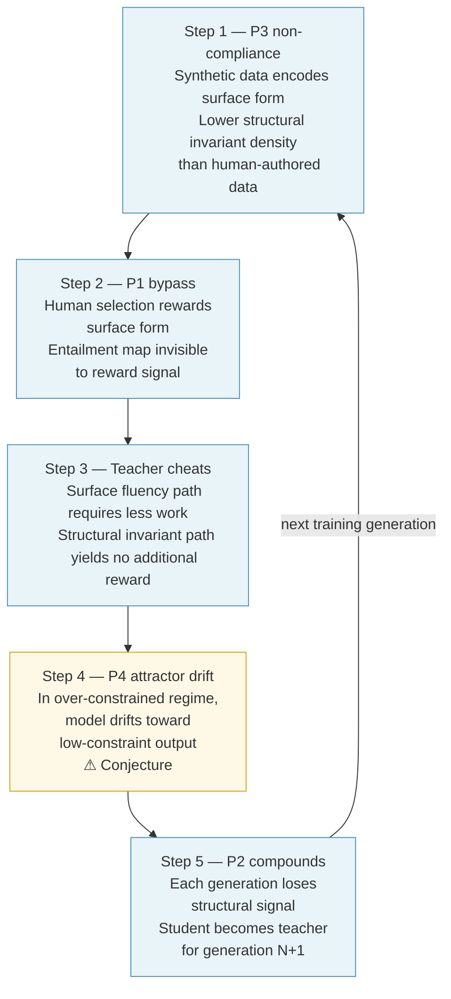

# Substrate-Independent Reasoning Communication (SIRC) — Derived Analysis: AI Training Paradigm

## Table of Contents

| Section | Claim |
| :--- | :--- |
| §1 — Structural diagnosis | The current AI paradigm does not target $\mathsf{P1}\text{–}\mathsf{P4}$ compliance; each principle identifies a precise point of divergence. |
| §2 — Model collapse mechanism | Model collapse is mechanistically explained by $\mathsf{P1}\text{–}\mathsf{P4}$: structural invariant degradation precedes and drives surface form degradation. |
| §3 — Current mitigations | No current approach achieves $\mathsf{P1}$ compliance for general reasoning; all optimise proxies of the invariant, not the invariant itself. |
| §4 — $\mathsf{P1}$-compliant training | $\mathsf{P1}$-compliant training requires three independent structural changes; none requires the others to be solved first. |
| §5 — Falsifiable predictions | The SIRC account generates predictions that differ from the standard model collapse account and are independently testable. Prediction 5 is testable now with the verifier toolset. |

**Dependency on principles:** All claims trace to [[SIRC_principles|SIRC Principles]] § $\mathsf{P1}$–§ $\mathsf{P4}$. No new principles are introduced. Claims not derivable from $\mathsf{P1}\text{–}\mathsf{P4}$ are marked *Conjecture*.

*External reference: Model collapse as an established phenomenon — Shumailov et al. (2023), "The Curse of Recursion."*

---

## Status and scope

This document applies the four SIRC principles ( $\mathsf{P1}\text{–}\mathsf{P4}$) to the current AI training paradigm as a diagnostic framework. It does not introduce new principles or extend existing ones. Every claim traces back to a specific principle or is labeled with its epistemic status.

*Epistemic keys:*
- `*(D) Derived*` — follows from $\mathsf{P1}\text{–}\mathsf{P4}$ by logical consequence
- `*(C) Conjecture*` — consistent with $\mathsf{P1}\text{–}\mathsf{P4}$, not yet demonstrated empirically
- `*(E) Established*` — supported by prior literature independently of SIRC

---

## §1 — Structural diagnosis of the current AI paradigm

The current paradigm does not attempt SIRC-compliant transmission. It operates under different objectives. The four principles identify precisely where the objectives diverge.

$\mathsf{P1}$ **absence — Surface form evaluated, not invariant structure.** *(D)*
The industry evaluates AI output by asking: does this sound like a good answer? Metrics — human preference ratings, BLEU, ROUGE, benchmark scores — measure surface form, fluency, and outcome correctness. None verify whether the entailment map and dependency structure of the output are entailment-equivalent to a ground truth. The evaluation signal has never targeted $\mathsf{P1}$ compliance. This is not a failure of implementation; it is a different objective.

$\mathsf{P2}$ **misread — Substrate mismatch treated as an engineering problem.** *(D)*
The dominant assumption is that the gap between human intent and AI output can be closed through more data, more compute, or better fine-tuning. $\mathsf{P2}$ establishes that full-state transmission is inherently lossy (DPI) — that loss cannot be eliminated. Whether invariant structural content is also at risk under substrate mismatch is unresolved (OQ2.1 in SIRC_principles § $\mathsf{P2}$ — whether invariant structural content is at risk under substrate mismatch), but the design directive follows either way: target invariant preservation, not full fidelity. Treating the gap as an engineering problem to be closed misframes the objective. The current paradigm attempts neither the correct target nor the correct design response.

$\mathsf{P3}$ **inversion — Content transmitted, not boundary conditions.** *(D)*
Training on examples of what people said is content transmission. The model is shown billions of instances of outputs, not the boundary conditions of how the logic must work. Fine-tuning, RLHF, and synthetic data generation all operate in this mode. The result is a model trained to reproduce content patterns, not to encode or reconstruct from constraint packets. This is a structural inversion of $\mathsf{P3}$: the current paradigm transmits what $\mathsf{P3}$ identifies as surface form.

**The mechanism this produces is Monte Carlo search over training distribution.** *(D)* When a model encounters a problem, it samples the nearest plausible output from its training distribution — not the constraint-determined reconstruction $\mathsf{P3}$ requires. For in-distribution problems (e.g., the standard Wolf–Goat–Cabbage solution), training density is high and the sampled output is correct. For out-of-distribution variants (e.g., ablation of WGC rules, constraint graph boundary cases), training density is near zero and the model samples "what this type of output looks like" — directional reasoning, plausible units, wrong values. The output looks reasonable; the values are wrong. This failure mode survives multi-model audit because all auditors sample the same distribution. The error is not idiosyncratic — it is systematic across the training corpus.

*Concrete instance:* The §7 ablation table in `P_3_river_crossing.md` was written before enumeration. Five of five non-baseline rows had errors — directional estimates instead of computed values. None were caught by multi-model audit. The WGC baseline (7-move solution) has maximum training density; the ablation variants have near-zero density. The model reasoned correctly about direction, incorrectly about values — exactly the Monte Carlo prediction.

$\mathsf{P4}$ **violation — Simultaneous minimisation attempted.** *(D)*
The industry minimises sender work (natural language prompts requiring no formal specification) and receiver work (low-latency inference optimised for throughput) simultaneously. $\mathsf{P4}$ establishes that in the over-constrained regime — where the reasoning structure is dense relative to the receiver's knowledge — sender and receiver work are inversely coupled, and reducing one expands the other. The simultaneous minimisation is achievable only by abandoning the $\mathsf{P1}$ objective. Surface form reproduction has no such coupling; structural invariant transmission in the over-constrained regime does. The free lunch exists only because the problem being solved was changed.

---

## §2 — The model collapse mechanism

Model collapse — the progressive degradation of model quality under synthetic training (Shumailov et al., 2023) — is *(E) established* in the literature. The SIRC principles provide a more mechanistically precise account than the standard "distribution narrowing" explanation.

**The mechanism, step by step:**

**Step 1 — $\mathsf{P3}$ non-compliance enters the training loop.** *(D)*
Synthetic data is produced by models doing content transmission. Each generated example encodes surface form patterns, not boundary conditions. The structural invariant signal present in human-authored training data — imperfect but real, accumulated from human reasoning in writing — is not reproduced by content generation. Synthetic data has lower structural invariant density than the human data it replaces.

**Step 2 — Human selection acts as a $\mathsf{P1}$ bypass.** *(D)*
RLHF selects for human preference. Verifying $\mathsf{P1}$ compliance — checking that the entailment map and dependency structure are preserved — requires the same structural reasoning the model is supposed to have learned. Human evaluators cannot efficiently perform this check at scale. The selection pressure reaches the surface form layer and does not reach the structural invariant layer. $\mathsf{P1}$ compliance is invisible to the reward signal.

**Step 3 — The teacher can cheat.** *(D)*
A model producing synthetic training data is rewarded for surface acceptability, not structural correctness. It can produce "close enough" content — fluent, coherent-sounding, preference-maximising — with degraded entailment structure and still pass selection. The path of minimum resistance (lowest loss under the reward signal) is surface form optimisation. The structural invariant path requires more work and yields no additional reward. The teacher is not incentivised to maintain $\mathsf{P1}$ compliance.

**Step 4 — $\mathsf{P4}$ attractor drift.** *(C)*
As training progresses, the model drifts toward the low-constraint end of the $\mathsf{P4}$ trade-off curve. Outputs become easier to generate (lower sender work) and more ambiguous in structure (higher receiver work to extract meaning). In the over-constrained regime this coupling is inverse — less sender constraint means more receiver work. The model optimises for the attractor the reward signal defines — surface fluency — not for the attractor $\mathsf{P1}$ requires — structural invariant preservation.

**Step 5 — $\mathsf{P2}$ compounds across generations.** *(D)*
Each synthetic training generation introduces loss. The student trained on generation $N$ has less structural invariant signal than the teacher. The student becomes the teacher for generation $N+1$. $\mathsf{P2}$ applied as a recurrence: the loss compounds. The distribution does not merely narrow — it structurally degrades. Surface form is preserved longer than structural coherence because surface form is what the reward signal maintains.

(Steps 1–3 and 5 are derived from $\mathsf{P1}\text{–}\mathsf{P4}$. Step 4 is the only conjecture in the chain.)

**The distinction from standard model collapse:** *(D)*
The standard account predicts distribution narrowing — rare but correct outputs disappear. The SIRC account predicts a specific ordering: *structural invariant degradation precedes surface form degradation*. Outputs remain fluent while entailment maps and dependency structures decay. This is a different and more precise prediction. See §5.

---

## §3 — Current mitigations and structural limits

| Approach | $\mathsf{P1}$ proximity | Structural limit |
|---|---|---|
| Formal verification (AlphaProof, Lean) | Closest — checks entailment correctness formally | Domain-limited: only works where a formal verifier exists (mathematics, code). No general reasoning verifier exists. |
| Process reward models | $\mathsf{P1}$-adjacent — evaluates reasoning steps, not just output | Steps evaluated by surface acceptability, not entailment map isomorphism. Makes the DAG visible; does not verify it. |
| Reasoning models (o1, R1, chain-of-thought) | Partially $\mathsf{P1}$-adjacent — makes dependency structure explicit | Training signal rewards outcome correctness and fluency, not structural invariant preservation. Explicit reasoning chain is not verified for $\mathsf{P1}$ compliance. |
| Constitutional AI / RLAIF | Marginally improved proxy | Principles expressed in natural language; evaluation still surface-form based. Higher-quality proxy, not structural verification. |
| Data curation / quality filtering | Reduces $\mathsf{P3}$ noise | Removes some low-quality signal; does not add $\mathsf{P1}$-verified signal. The correct signal is absent, not merely diluted. |
| RAG | Partial $\mathsf{P1}$ protection for factual content | Grounds output in retrieved content, reducing hallucination. Retrieval and generation are not $\mathsf{P1}$-verified. Protects against content drift, not structural invariant drift. |
| Expert RLHF | Marginally higher structural signal | Experts catch more logical errors. Cannot formally verify entailment maps at scale. Reduces the $\mathsf{P1}$ bypass, does not close it. |

**The common structural limit across all approaches:** *(D)*
None achieve $\mathsf{P1}$ compliance for general reasoning. Formal verification comes closest but only for formal domains. The shared constraint is OQ1.2 (SIRC_principles § $\mathsf{P1}$ — whether invariant structural properties are extractable from neural substrates) — still open. Without a general $\mathsf{P1}$ verifier, no training pipeline can directly reward entailment map preservation. All current approaches optimise proxies of $\mathsf{P1}$, not $\mathsf{P1}$ itself.

**The consumer query problem:** *(D)*
Continuous deployment to large consumer populations introduces a sustained $\mathsf{P1}$ non-compliant signal. Consumer queries are predominantly surface-form oriented — ambiguous natural language, preference-seeking, not constraint-based. RLHF from consumer feedback rewards surface-form acceptable responses to structurally informal queries. The structural invariant signal from formal domain training is diluted by volume. The erosion rate scales with deployment scale; the building rate does not.

---

## §4 — What $\mathsf{P1}$-compliant training would require

Three structural requirements, independent of each other. None requires the others to be solved first.

**Requirement 1 — $\mathsf{P1}$ verification in the reward signal.** *(D)*
The training signal must directly reward entailment map and dependency structure preservation. For formal domains (mathematics, code, formal logic), this is achievable now through automated verification. For general reasoning, it requires solving OQ1.2 — extractability of invariant structural properties from neural substrates. This is the highest-value open question in the SIRC research agenda as applied to training.

*The verification mechanism for general reasoning is *(C)* pending OQ1.2.*

**Requirement 2 — Architectural separation of structural invariant and surface form layers.** *(D)*
The model's structural invariant representations must be isolated from surface-form training signals. Consumer feedback, RLHF preference ratings, and synthetic data should update the surface form layer without propagating to the structural invariant layer. The structural layer should be updated only by $\mathsf{P1}$-verified signal.

This separation does not exist in current architectures. Fine-tuning and RLHF update the full model. The closest approximations — mixture of experts with selective routing, frozen layers during fine-tuning — are accidental rather than designed.

Note: non-reasoning semantic content (tone, cultural register, narrative surface) should update the surface form layer. Mutation of non-invariant surface content is designed behaviour under $\mathsf{P2}$, not a failure. The separation must distinguish what $\mathsf{P1}$ protects (structural invariants) from what $\mathsf{P2}$ accepts as designed loss (surface form variation). See the hero's journey case in the principles document OQ2.1.

*The implementation mechanism is *(C)*.*

**Requirement 3 — Consumer query constraint packet translation.** *(C)*
Consumer queries in natural language are $\mathsf{P3}$ non-compliant — they transmit intent and content, not boundary conditions. Before reaching the structural invariant layer, queries should be translated into constraint packets: the structural boundary conditions of what the query is asking, not the surface content of how it was asked.

This is the most tractable near-term direction. It does not require solving OQ1.2 — it requires a pre-processing layer that extracts structural constraints from natural language. The model's structural reasoning layer then operates on constraint inputs rather than raw surface-form inputs, isolating it from the $\mathsf{P1}$ non-compliant signal at the query boundary.

*No general-purpose implementation of this exists. Domain-specific pipelines (NL-to-SQL, NL-to-SMT) approximate this for narrow formal domains; the extraction mechanism for general reasoning is the open problem.*

---

## §5 — Falsifiable predictions

The SIRC derivation generates predictions that differ from the standard model collapse account. These are testable independently of whether SIRC is implemented.

**Prediction 1 — Structural degradation precedes surface form degradation.** *(C)*
Under synthetic training, entailment map preservation and dependency structure coherence should degrade before fluency and surface form acceptability. A model in early-stage collapse should produce fluent outputs with incorrect logical dependencies before it produces incoherent outputs. If surface form degrades first, this prediction is false and the SIRC mechanism account needs revision.

**Prediction 2 — Structural degradation is measurable as entailment error, not fluency error.** *(C)*
A probe trained to detect entailment map isomorphism — whether the logical dependencies in an output match a ground truth — should show earlier and faster degradation under synthetic training than fluency metrics. If entailment error and fluency error degrade at the same rate, $\mathsf{P1}$ structural invariants may not be separately represented in the model.

**Prediction 3 — $\mathsf{P1}$-verified synthetic data does not cause structural collapse.** *(C)*
Synthetic data generated with formal $\mathsf{P1}$ verification (entailment checked against a verifier) should not produce the structural degradation pattern, even at the same volume as unverified synthetic data. If $\mathsf{P1}$-verified synthetic data still causes structural collapse, the SIRC mechanism is not the primary driver.

**Prediction 4 — Consumer query volume correlates with structural invariant degradation rate.** *(C)*
Models fine-tuned on larger consumer feedback datasets should show faster structural invariant degradation (measured by entailment error) than models fine-tuned on smaller, higher-quality datasets, holding surface form quality constant. If no correlation exists, the consumer query $\mathsf{P1}$ bypass mechanism is not the primary driver.

**Prediction 5 — UNSAT puzzles expose distribution-sampling vs. structural reasoning.** *(C)*
A certified unsolvable puzzle — where Z3 BMC produces an explicit UNSAT certificate — has a known correct answer: "this cannot be solved at this capacity." A model doing distribution sampling will confabulate a solution (sampling "what a solution looks like") or pattern-match "this seems hard" without identifying the structural reason. A model doing structural reasoning will identify the mechanism: boat capacity is below $\tau(G) $, the bottleneck node cannot be managed at this capacity, no valid path to the goal exists.

Three observable outcomes in ascending order of structural reasoning evidence:

| Outcome | What it indicates |
|---|---|
| Claims a solution | Pure confabulation — distribution sampling with no grounding |
| States unsolvable but cannot say why | Pattern-matched difficulty signal — no structural mechanism identified |
| Identifies the structural reason ( $\tau(G) $, bottleneck topology, capacity threshold) | Qualitatively different from distribution sampling |

This prediction is testable *now* with the verifier and generator toolset — no full SIRC training apparatus required. The puzzle spec, UNSAT certificate, and structural explanation are all machine-producible. The AI behaviour is externally observable. This probe does not require OQ1.2 (extractability of invariants from neural substrates) to be resolved — the test is behavioural, not mechanistic.

*If all current SOTA models produce confabulated solutions to certified UNSAT puzzles at non-trivial $\tau(G) $, Prediction 1 (structural degradation precedes surface form degradation) gains supporting evidence: the surface output (a plausible-sounding solution) is structurally wrong. If any model reliably identifies the structural reason across novel certified UNSAT puzzles it has not seen, that is the first behavioural evidence against the Monte Carlo characterisation.*
